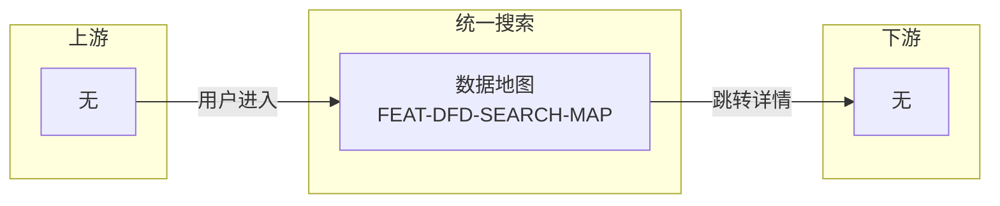
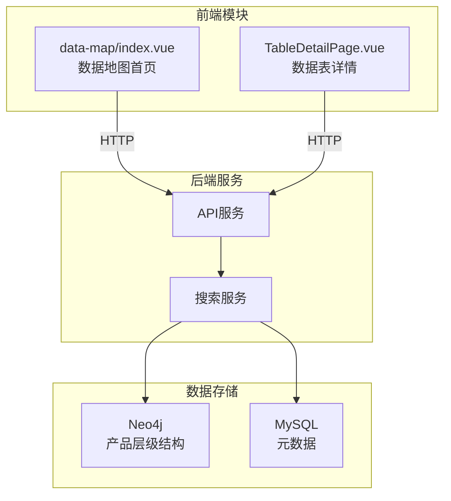

---
neo4j:
  epic: "Epic:EPIC-DFD-SEARCH"
feishu:
  wiki: "V8KEfpg1vlkCZld"
doc:
  title: "EPIC-DFD-SEARCH统一搜索-Epic说明文档"
  version: "v1.0"
  type: "EPIC说明文档"
  productDomain: "PD-DFD"
  epicKey: "Epic:EPIC-DFD-SEARCH"
  author: "Tony Stark"
  createdAt: "2026-04-30"
  updatedAt: "2026-04-30"
---

# EPIC-DFD-SEARCH - 统一搜索（数据地图）

> **版本**: v1.0
> **日期**: 2026-04-30
> **作者**: Tony Stark
> **状态**: 已完成

---

## 1. EPIC 基本信息

| 字段 | 内容 |
|:---|:---|
| EPIC ID | EPIC-DFD-SEARCH |
| EPIC 名称 | 统一搜索（数据地图） |
| 所属产品域 | PD-DFD 数据发现 |
| 负责人 | Tony Stark |
| Feature数 | 1 |

---

## 2. 逻辑架构图（业务流程）

### 2.1 逻辑流程说明

| 阶段 | 功能 | 业务流程 | 说明 |
|:---|:---|:---|:---|
| 入口 | 数据地图 | 用户通过数据地图首页进入 | 统一入口，无明确目的 |
| 处理 | 搜索筛选 | 用户通过关键词或高级筛选查找 | 快速定位 |
| 出口 | 跳转详情 | 用户点击进入数据表详情页 | 有明确目的后的操作 |

---

## 3. 物理架构图（系统模块）

### 3.1 系统模块说明

| 模块 | 类型 | 说明 |
|:---|:---|:---|
| data-map/index.vue | 前端 | 数据地图首页，包含搜索框、筛选器、集合展示 |
| TableDetailPage.vue | 前端 | 数据表详情页 |
| API服务 | 后端 | 统一API网关 |
| 搜索服务 | 后端 | 搜索引擎服务 |

---

## 4. 功能范围

### 4.1 Feature 清单

| # | Feature ID | Feature 名称 | 优先级 | 状态 |
|:---:|:---|:---|:---:|:---:|
| 1 | FEAT-DFD-SEARCH-MAP | 数据地图 | P0 | 已上线 |

### 4.2 包含的功能

| 功能模块 | 功能描述 |
|:---|:---|
| 数据地图 | 关键词搜索、高级筛选、关注功能、常用表集合、核心业务流程、数据体系全景 |

### 4.3 不包含的功能

- 指标详情（FEAT-DFD-INDEX-DETAIL）
- 变量详情（FEAT-DFD-VARIABLE-DETAIL）
- 特征详情（FEAT-DFD-CHARACTER-DETAIL）

---

## 5. 菜单结构与功能映射

### 5.1 顶部导航栏（全角色可见）

**入口**：数据发现 → 数据地图

| 序号 | 菜单名称 | 功能说明 | 权限说明 |
|:---:|:---|:---|:---|
| 1 | 数据地图 | 数据发现统一入口 | 全部角色 |

### 5.2 左侧菜单栏

#### （一）数据发现

| 一级菜单 | 二级菜单 | 功能说明 | 权限说明 |
|:---|:---|:---|:---|
| 数据地图 | - | 统一搜索入口 | 全部角色 |

### 5.3 路由与组件映射

| 菜单路径 | 路由 | 组件 | 说明 |
|:---|:---|:---|:---|
| 数据地图 | /discovery/data-map | data-map/index.vue | 搜索首页 |
| 数据表详情 | /discovery/data-map/detail/:id | TableDetailPage.vue | 表详情 |

### 5.4 权限说明

| 角色 | 可访问菜单 |
|:---|:---|
| 管理员 | 全部 |
| 普通用户 | 全部（只读） |

---

## 6. 与其他 EPIC 的关系

### 6.1 依赖的 EPIC

| EPIC ID | 依赖类型 | 说明 |
|:---|:---|:---|
| PD-DMT | 数据依赖 | 搜索的内容来自 PD-DMT 的元数据管理 |

### 6.2 被依赖的 EPIC

| EPIC ID | 说明 |
|:---|:---|
| EPIC-DFD-ASSET | 数据表详情页被数据地图跳转调用 |

---

## 7. 技术说明

### 7.1 技术选型

| 层级 | 技术选型 | 说明 |
|:---|:---|:---|
| 前端 | Vue 3 + Composition API | 主流前端框架 |
| UI组件库 | Arco Design Vue | 企业级UI组件 |
| 图数据库 | Neo4j | 存储产品层级结构 |
| 构建工具 | Vite | 快速构建 |

### 7.2 关键接口

| 接口 | 说明 |
|:---|:---|
| /api/discovery/search | 数据搜索接口 |
| /api/discovery/table/:id | 数据表详情接口 |

---

## 8. 变更记录

| 日期 | 版本 | 变更内容 | 作者 |
|:---|:---:|:---|:---|
| 2026-04-30 | v1.0 | 初始版本，基于功能清单走查重构 | Tony Stark |

---

🦾 *EPIC说明文档 v1.0 - 统一搜索*