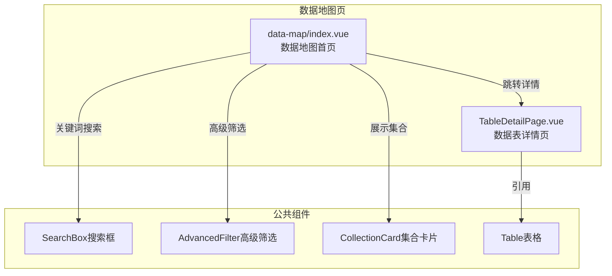
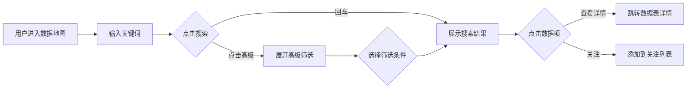

---
neo4j:
  feature: "FEAT-DFD-SEARCH-MAP"
feishu:
  wiki: "V8KEfpg1vlkCZld"
doc:
  title: "FEAT-DFD-SEARCH-MAP数据地图-Feature说明文档"
  version: "v1.0"
  type: "Feature说明文档"
  productDomain: "PD-DFD"
  epicKey: "Epic:EPIC-DFD-SEARCH"
  featureKey: "FEAT-DFD-SEARCH-MAP"
  author: "Tony Stark"
  createdAt: "2026-04-30"
  updatedAt: "2026-04-30"
---

# FEAT-DFD-SEARCH-MAP - 数据地图

> **版本**: v1.0
> **日期**: 2026-04-30
> **作者**: Tony Stark
> **状态**: 已完成

---

## 1. Feature 基本信息

| 字段 | 内容 |
|:---|:---|
| Feature ID | FEAT-DFD-SEARCH-MAP |
| Feature 名称 | 数据地图 |
| 所属 EPIC | EPIC-DFD-SEARCH 统一搜索 |
| 所属产品域 | PD-DFD 数据发现 |
| 负责人 | Tony Stark |

---

## 2. Feature 概述

### 2.1 是什么
数据地图是数据发现模块的核心入口，提供统一的搜索和导航能力，支持关键词搜索、高级筛选、数据集合管理、业务域导航等功能，帮助用户快速找到所需的数据资产。

### 2.2 解决什么问题
- 数据分散，难以快速找到所需的数据资产
- 缺乏统一的搜索入口，用户不知道去哪里找数据
- 没有数据集合管理能力，无法快速访问常用数据

### 2.3 用户场景

| 场景 | 用户 | 描述 |
|:---|:---|:---|
| 快速定位 | 数据分析师 | 通过关键词快速搜索目标数据表 |
| 集合管理 | 数据开发者 | 将常用数据添加到集合，方便下次访问 |
| 业务域导航 | 数据管理员 | 通过业务域导航了解数据体系全景 |

---

## 3. 系统模块图

### 3.1 页面说明

| 页面 | 路由 | 组件 | 说明 |
|:---|:---|:---|:---|
| 数据地图 | /discovery/data-map | data-map/index.vue | 统一搜索入口首页 |

### 3.2 组件说明

| 组件 | 类型 | 说明 |
|:---|:---|:---|
| SearchBox | 业务 | 搜索框组件，支持多关键字模糊匹配 |
| AdvancedFilter | 业务 | 高级筛选器，支持模块/类型/域/频率筛选 |
| CollectionCard | 业务 | 数据集合卡片组件 |
| Table | 公共 | 列表展示组件 |

---

## 4. 功能说明

### 4.1 功能清单

| 功能点 | 类型 | 描述 |
|:---|:---|:---|
| FP-001 | 页面 | 关键词搜索，支持多关键字模糊匹配。**筛选器**：搜索模块下拉(全部/数据表/业务概念/指标)、数据类型下拉(数据表/指标/外部数据) |
| FP-002 | 页面 | 高级筛选，支持展开详细筛选条件。**筛选条件**：业务域(用户域/交易域/产品域/风控域)、更新频率(实时/日更新/周更新/月更新)、支持"包含"和"剔除"多条件组合 |
| FP-003 | 页面 | 关注功能，将数据表添加到关注列表。**状态**：已关注的数据可通过筛选器快速筛选 |
| FP-004 | 页面 | 常用表集合，展示用户常用数据集合。**交互**：点击"查看更多"跳转集合管理页面，点击集合卡片进入集合内数据表 |
| FP-005 | 页面 | 核心业务流程，展示核心业务流程集合。**交互**：点击业务域节点进入业务域详情 |
| FP-006 | 页面 | 数据体系全景，业务域导航和快速入口。**快速添加标签**：用户域/交易域/风控域/营销域 |

### 4.2 用户流程

---

## 5. 验收标准

| 验收项 | 标准 |
|:---|:---|
| 功能验收 | 关键词搜索支持多关键字模糊匹配，响应时间≤2s |
| 功能验收 | 高级筛选支持模块/类型/域/频率多维度筛选，筛选条件支持"包含"和"剔除"组合 |
| 功能验收 | 关注功能点击即时生效，已关注数据可通过筛选器快速筛选 |
| 功能验收 | 常用表集合展示用户收藏的数据表，点击卡片进入集合 |
| 功能验收 | 核心业务流程展示业务域集合，点击业务域节点进入详情 |
| 功能验收 | 数据体系全景提供业务域导航入口 |
| 交互验收 | 支持键盘回车搜索 |
| 性能验收 | 页面加载时间≤2s |

---

## 6. 依赖关系

| 依赖项 | 类型 | 说明 |
|:---|:---|:---|
| PD-DMT | 数据依赖 | 数据地图展示的数据来自 PD-DMT 的元数据管理，包括上下架状态、数据资产信息 |
| Neo4j | 数据 | 存储产品层级结构和血缘关系 |

---

## 7. 变更记录

| 日期 | 版本 | 变更内容 | 作者 |
|:---|:---:|:---|:---|
| 2026-04-30 | v1.0 | 初始版本，基于功能清单走查重构，符合模板v1.2 | Tony Stark |

---

🦾 *Feature说明文档 v1.0 - 数据地图*