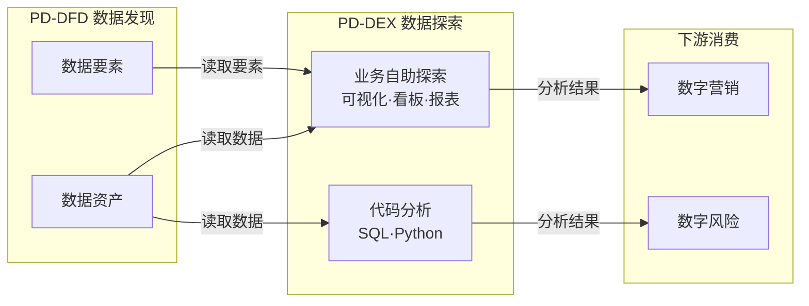
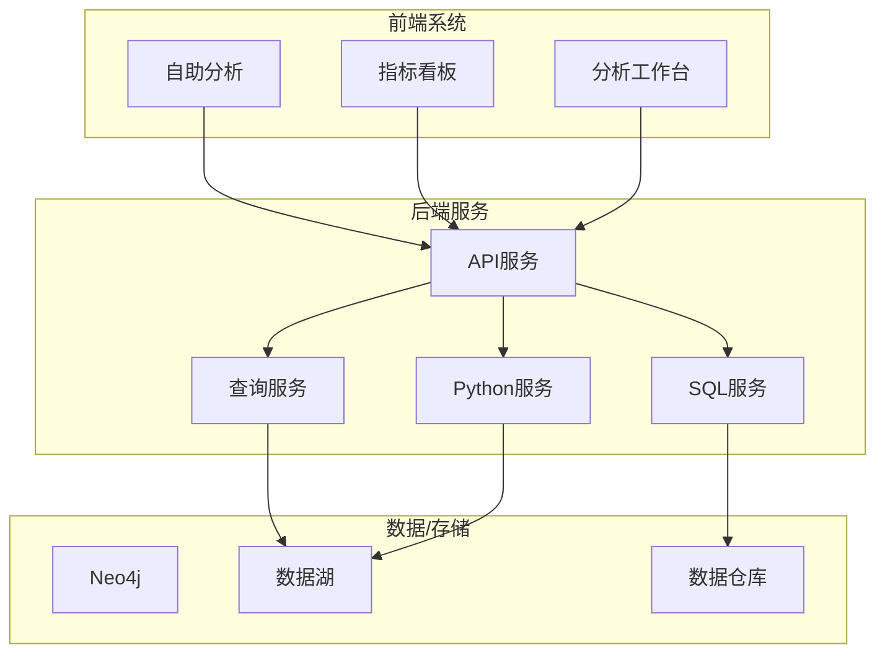

---
neo4j:
  productDomain: "PD-DEX"
feishu:
  wiki: "V8KEfpg1vlkCZld"
doc:
  title: "PD-DEX数据探索-产品域说明文档"
  version: "v1.0"
  type: "产品域说明文档"
  productDomain: "PD-DEX"
  author: "Tony Stark"
  createdAt: "2026-05-06"
  updatedAt: "2026-05-06"
---

# PD-DEX 数据探索 - 产品域说明文档

> **版本**: v1.0
> **日期**: 2026-05-06
> **作者**: Tony Stark
> **状态**: 规划中

---

## 1. 产品域概述

### 1.1 基本信息

| 字段 | 内容 |
|:---|:---|
| 产品域 ID | PD-DEX |
| 产品域名称 | 数据探索 |
| 英文名 | Data Exploration |
| 所属业务线 | 数字社区 |
| 产品负责人 | Tony Stark |
| 创建日期 | 2026-04-24 |

### 1.2 产品域定位

**分析层** - 数据分析和自助探索平台

PD-DEX 是面向消费金融业务场景的数据分析平台，为用户提供即席查询、自助分析、指标看板等能力。

### 1.3 核心价值

| 价值维度 | 说明 |
|:---|:---|
| 用户价值 | 降低数据分析门槛，业务人员可自主分析 |
| 业务价值 | 提升数据分析效率，支撑业务决策 |
| 技术价值 | 统一分析工具栈，提升分析师人效 |

---

## 2. 逻辑架构图（业务流程）

> **用途**：描述业务域之间的流程流转，供产品/运营/业务方理解
> **关注点**：业务流程、活动流转、数据流向
> **特点**：无系统边界概念，关注"做什么"

### 2.1 逻辑层级说明

| 层级 | Epic/模块 | 业务流程 | 说明 |
|:---|:---|:---|:---|
| 自助层 | 业务自助探索 | 可视化自助分析、看板监控、报表订阅 | 无代码，业务自主 |
| 代码层 | 代码分析 | SQL查询、Python建模、即席查询 | 分析师工具 |

---

## 3. 物理架构图（系统模块）

> **用途**：描述系统模块之间的调用关系，供开发/测试/架构师理解
> **关注点**：系统边界、模块间调用、数据流
> **特点**：有明确的技术实现和系统边界

### 3.1 系统模块说明

| 模块 | 类型 | 说明 |
|:---|:---|:---|
| 自助分析 | 前端 | 可视化拖拽分析 |
| 指标看板 | 前端 | 监控图表配置 |
| 分析工作台 | 前端 | SQL/Python 编辑器 |
| API服务 | 后端 | 统一 API 网关 |
| 查询服务 | 后端 | 即席查询引擎 |
| SQL服务 | 后端 | SQL 执行引擎 |
| Python服务 | 后端 | Python 分析环境 |

---

## 4. Epic 列表

| 序号 | Epic ID | Epic 名称 | Feature 数量 |
|:---:|:---|:---|:---:|
| 1 | EPIC-DEX-ANALYSIS | 业务自助探索 | 5 |
| 2 | EPIC-DEX-CODE | 代码分析 | 4 |

### 4.1 Epic 详细

#### EPIC-DEX-ANALYSIS 业务自助探索

| 属性 | 值 |
|:---|:---|
| Epic ID | EPIC-DEX-ANALYSIS |
| Epic 名称 | 业务自助探索 |
| 目标 | 提供可视化自助分析能力，降低数据分析门槛 |
| 负责人 | Tony Stark |

**Feature 列表**：
| Feature | 名称 | 优先级 |
|:---|:---|:---:|
| FEAT-DEX-VISUAL | 可视化自助分析 | P0 |
| FEAT-DEX-DASHBOARD | 指标看板 | P0 |
| FEAT-DEX-REPORT | 自助报表 | P1 |
| FEAT-DEX-SUBSCRIBE | 报表订阅 | P1 |
| FEAT-DEX-COMPLIANCE | 合规数据输出 | P1 |

---

#### EPIC-DEX-CODE 代码分析

| 属性 | 值 |
|:---|:---|
| Epic ID | EPIC-DEX-CODE |
| Epic 名称 | 代码分析 |
| 目标 | 提供 SQL/Python 等代码分析能力，赋能专业分析师 |
| 负责人 | Tony Stark |

**Feature 列表**：
| Feature | 名称 | 优先级 |
|:---|:---|:---:|
| FEAT-DEX-SQL | SQL 查询 | P0 |
| FEAT-DEX-PYTHON | Python 分析 | P0 |
| FEAT-DEX-ADHOC | 即席查询 | P0 |
| FEAT-DEX-DATASET | 数据集管理 | P1 |

---

## 5. 能力地图

> **用途**：描述产品核心能力矩阵，含关键能力子项、业务价值、建设情况
> **关注点**：能力项与业务价值对应，建设阶段清晰

### 5.1 业务自助探索能力

| 关键能力 | 能力子项 | 业务价值 | 建设情况 |
|:---|:---|:---|:---:|
| 业务自助探索能力 | 可视化自助分析能力 | 业务人员无需代码，自主完成临时探索与多维拆解，减少提数依赖 | 🟡部分实现，建设中 |
| 业务自助探索能力 | 主体全景洞察能力 | 统一主体数据认知，支撑经营研判与个案核查 | 🟡部分实现，建设中 |
| 业务自助探索能力 | 指标看板监控能力 | 固化常态化监测场景，实时掌握业务运行态势 | 🟢已实现 |
| 业务自助探索能力 | 自助报表与订阅能力 | 沉淀标准化分析成果，实现报表自动化、常态化触达 | 🟡部分实现，建设中 |
| 业务自助探索能力 | 合规数据输出能力 | 满足业务取数需求，平衡使用效率与数据安全合规 | 🟡部分实现，建设中 |

### 5.2 代码分析能力

| 关键能力 | 能力子项 | 业务价值 | 建设情况 |
|:---|:---|:---|:---:|
| 代码分析能力 | 在线即席查询能力 | 快速响应临时查数、数据校验类诉求 | 🟢已实现 |
| 代码分析能力 | SQL 自主加工能力 | 赋能专业分析师自主实现复杂逻辑计算与数据处理 | 🟢已实现 |
| 代码分析能力 | Python 分析建模能力 | 支撑算法分析、特征工程、机器学习建模、深度数据分析 | 🟢已实现 |
| 代码分析能力 | 数据集沉淀管理能力 | 统一复用加工逻辑，降低重复开发成本，提升分析效率 | 🟡部分实现，建设中 |

### 5.3 能力地图汇总

| 能力域 | 🟢已实现 | 🟡部分实现 | ⏸️已规划 | 合计 |
|:---|:---:|:---:|:---:|:---:|
| 业务自助探索能力 | 1 | 4 | 0 | 5 |
| 代码分析能力 | 3 | 1 | 0 | 4 |
| **合计** | **4** | **5** | **0** | **9** |

---

## 6. 菜单结构与功能映射

> **用途**：供技术团队（钟离等）绑定路由和组件

### 6.1 左侧菜单栏

#### （一）数据探索

| 一级菜单 | 二级菜单 | 功能说明 | 权限说明 |
|:---|:---|:---|:---|
| 自助分析 | - | 可视化分析入口 | 全部角色 |
| | 临时探索 | 拖拽式数据分析 | 全部角色 |
| | 全景洞察 | 主体数据视图 | 全部角色 |
| 指标看板 | - | 监控看板入口 | 全部角色 |
| | 我的看板 | 个人看板列表 | 全部角色 |
| | 公共看板 | 共享看板 | 全部角色 |
| 分析工作台 | - | SQL/Python 工作台 | 分析师 |
| | SQL 查询 | SQL 编辑器 | 分析师 |
| | Python 分析 | Jupyter 环境 | 分析师 |

### 6.2 权限说明

| 角色 | 可访问菜单 |
|:---|:---|
| 管理员 | 全部 |
| 分析师 | 自助分析、指标看板、分析工作台 |
| 普通用户 | 自助分析（只读）、指标看板（只读） |

---

## 7. 依赖关系

### 7.1 依赖的其他产品域

| 产品域 | 依赖类型 | 说明 |
|:---|:---|:---|
| PD-DFD 数据发现 | 数据依赖 | PD-DEX 从 PD-DFD 读取数据资产进行探索 |
| PD-DMT 数据管理 | 元数据依赖 | 读取元数据进行展示 |

### 7.2 依赖的外部系统

| 系统 | 依赖类型 | 接口地址 | 说明 |
|:---|:---|:---|:---|
| Neo4j | 数据存储 | localhost:7687 | 存储产品层级结构 |
| 数据湖 | 数据存储 | - | 存储原始数据 |
| 数据仓库 | 数据存储 | - | 存储加工数据 |

---

## 8. 变更记录

| 日期 | 版本 | 变更内容 | 作者 |
|:---|:---:|:---|:---|
| 2026-05-06 | v1.0 | 初始版本，参考Epic结构创建；新增能力地图模块 | Tony Stark |

---

🦈 *PD-DEX 数据探索产品域说明文档 v1.0 - 2026-05-06*