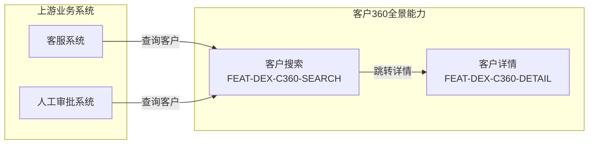
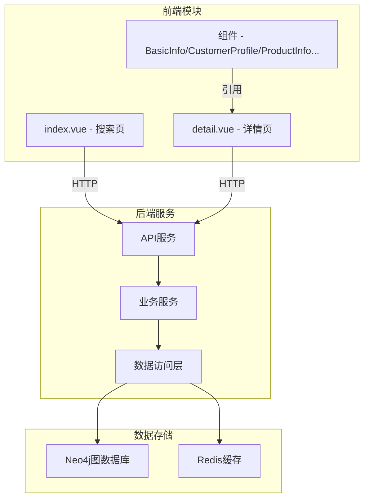

---
neo4j:
  epic: "Epic:EPIC-DEX-CUSTOMER_360"
  features:
    - "FEAT-DEX-C360-SEARCH"
    - "FEAT-DEX-C360-DETAIL"
    - "FEAT-DEX-C360-BASIC"
    - "FEAT-DEX-C360-PROFILE"
    - "FEAT-DEX-C360-PRODUCT"
    - "FEAT-DEX-C360-LOAN"
    - "FEAT-DEX-C360-ADJUST"
    - "FEAT-DEX-C360-COLLECT"
    - "FEAT-DEX-C360-CREDIT"
    - "FEAT-DEX-C360-MARKETING"
    - "FEAT-DEX-C360-PAYMENT"
    - "FEAT-DEX-C360-FEEDBACK"
    - "FEAT-DEX-C360-TAG"
    - "FEAT-DEX-C360-BEHAVIOR"
    - "FEAT-DEX-C360-RELATION"
feishu:
  wiki: "V8KEfpg1vlkCZld"
doc:
  title: "客户360 Epic说明文档"
  version: "v3.0"
  status: "已上线"
  productDomain: "PD-DEX"
  epicKey: "EPIC-DEX-CUSTOMER_360"
  author: "Tony Stark"
  createdAt: "2026-04-24"
  updatedAt: "2026-04-29"
---

# EPIC-DEX-CUSTOMER_360 - 客户360全景能力

> **版本**: v3.0
> **日期**: 2026-04-29
> **作者**: Tony Stark
> **状态**: 已上线

---

## 1. EPIC 基本信息

| 字段 | 内容 |
|:---|:---|
| EPIC ID | EPIC-DEX-CUSTOMER_360 |
| EPIC URI | `Epic:EPIC-DEX-CUSTOMER_360` |
| EPIC 名称 | 客户360全景能力 |
| 所属产品域 | PD-DEX 数据探索 |
| 负责人 | - |
| Feature数 | 15 |
| Story数 | 29 |

---

## 2. 逻辑架构图（业务流程）

### 2.1 逻辑流程说明

| 阶段 | 功能 | 业务流程 | 说明 |
|:---|:---|:---|:---|
| 入口 | 客户搜索 | 上游系统调用客户查询 | 客服/审批系统查询客户信息 |
| 处理 | 客户详情 | 展示客户全景数据 | 整合多维度客户数据 |
| 出口 | 无下游系统 | 本系统为信息提供方 | 仅支持查询，无下游流转 |

---

## 3. 物理架构图（系统模块）

### 3.1 系统模块说明

| 模块 | 类型 | 说明 |
|:---|:---|:---|
| index.vue | 前端 | 客户搜索入口，支持精确/模糊搜索 |
| detail.vue | 前端 | 客户详情页，聚合多模块数据 |
| BasicInfo.vue | 前端组件 | 基础信息展示组件 |
| CustomerProfile.vue | 前端组件 | 客户画像组件 |
| ProductInfo.vue | 前端组件 | 产品信息组件 |

---

## 4. 功能范围

### 4.1 Feature 清单

|  #  | Feature ID              | Feature 名称 | 优先级 |    状态     |
| :-: | :---------------------- | :--------- | :-: | :-------: |
|  1  | FEAT-DEX-C360-SEARCH    | 客户360搜索    | P0  | completed |
|  2  | FEAT-DEX-C360-DETAIL    | 客户360详情    | P0  | completed |
|  3  | FEAT-DEX-C360-BASIC     | 客户基本信息     | P1  |  backlog  |
|  4  | FEAT-DEX-C360-PROFILE   | 客户画像分析     | P2  |  backlog  |
|  5  | FEAT-DEX-C360-PRODUCT   | 产品信息总览     | P1  |  backlog  |
|  6  | FEAT-DEX-C360-LOAN      | 贷款记录管理     | P1  |  backlog  |
|  7  | FEAT-DEX-C360-ADJUST    | 调额历史       | P2  |  backlog  |
|  8  | FEAT-DEX-C360-COLLECT   | 催收记录       | P2  |  backlog  |
|  9  | FEAT-DEX-C360-CREDIT    | 征信记录       | P1  |  backlog  |
| 10  | FEAT-DEX-C360-MARKETING | 营销记录       | P2  |  backlog  |
| 11  | FEAT-DEX-C360-PAYMENT   | 支付流程       | P2  |  backlog  |
| 12  | FEAT-DEX-C360-FEEDBACK  | 数据反馈       | P3  |  backlog  |
| 13  | FEAT-DEX-C360-TAG       | 客户360标签    | P2  |  backlog  |
| 14  | FEAT-DEX-C360-BEHAVIOR  | 客户360行为轨迹  | P2  |  backlog  |
| 15  | FEAT-DEX-C360-RELATION  | 客户360关联关系  | P2  |  backlog  |

### 4.2 包含的功能

| 功能模块 | 功能描述 |
|:---|:---|
| 客户360搜索 | 精确搜索、模糊搜索、自动跳转详情 |
| 客户基本信息 | 基础信息脱敏展示、账户概览 |
| 客户画像分析 | 人口统计、行为特征、消费与风险特征 |
| 产品信息总览 | 授信明细列表、借据详情 |
| 贷款记录管理 | 还款明细、还款计划、放款记录 |
| 调额历史 | 额度调整历史展示 |
| 催收记录 | 催收详情与跟进记录 |
| 征信记录 | 征信报告查询与展示 |
| 营销记录 | 触达记录、权益发放、营销效果分析 |
| 支付流程 | 签约记录、还款记录 |
| 数据反馈 | 客户数据问题反馈入口 |

### 4.3 不包含的功能

- 客户360标签管理（规划中）
- 客户360行为轨迹分析（规划中）
- 客户360关联关系展示（规划中）

---

## 5. 菜单结构与功能映射

### 5.1 顶部导航栏（全角色可见）

**入口**：数据探索 → 客户360

| 序号 | 菜单名称 | 功能说明 | 权限说明 |
|:---:|:---|:---|:---|
| 1 | 客户360 | 客户搜索入口 | 全部角色 |

### 5.2 左侧菜单栏

#### （一）客户360

| 一级菜单 | 二级菜单 | 功能说明 | 权限说明 |
|:---|:---|:---|:---|
| 客户360 | - | 搜索页 | 全部角色 |
| | 详情 | 客户详情页 | 全部角色 |

### 5.3 路由与组件映射

| 菜单路径 | 路由 | 组件 | 说明 |
|:---|:---|:---|:---|
| 客户360 | /discovery/customer360 | index.vue | 搜索功能 |
| 客户详情 | /discovery/customer360/detail | detail.vue | 详情展示 |

### 5.4 权限说明

| 角色 | 可访问菜单 |
|:---|:---|
| 管理员 | 全部 |
| 普通用户 | 客户360搜索、详情 |

---

## 6. 与其他 EPIC 的关系

### 6.1 依赖的 EPIC

| EPIC ID | 依赖类型 | 说明 |
|:---|:---|:---|
| - | - | 暂无外部依赖 |

### 6.2 被依赖的 EPIC

> 客户360为信息提供方，暂无被下游业务系统依赖

| EPIC ID | 说明 |
|:---|:---|
| - | 暂无 |

---

## 7. 技术说明

### 7.1 技术选型

| 层级 | 技术选型 | 说明 |
|:---|:---|:---|
| 前端 | Vue 3 + TypeScript | 主流前端框架 |
| UI组件库 | Arco Design Vue | 企业级UI组件 |
| 图数据库 | Neo4j | 存储客户关系图谱 |
| 构建工具 | Vite | 快速构建 |

### 7.2 关键接口

| 接口 | 说明 |
|:---|:---|
| /api/customer360/search | 客户搜索接口 |
| /api/customer360/detail/{id} | 客户详情接口 |

---

## 8. 变更记录

| 日期 | 版本 | 变更内容 | 作者 |
|:---|:---:|:---|:---|
| 2026-04-24 | v2.0 | 基于 Neo4j 交叉核验后重建 | Tony Stark |
| 2026-04-29 | v3.0 | 同步功能清单，新增13个Feature/23条Story，补充frontmatter | Tony Stark |

---

🦈 *EPIC 说明文档 v3.0 - 2026-04-29*
