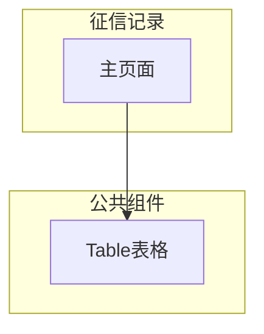
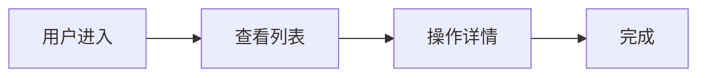

---
neo4j:
  epic: "Epic:EPIC-DEX-CUSTOMER_360"
  feature: "FEAT-DEX-C360-CREDIT"
feishu:
  wiki: "V8KEfpg1vlkCZld"
doc:
  title: "征信记录 Feature说明文档"
  version: "v1.0"
  status: "backlog"
  productDomain: "PD-DEX"
  epicKey: "EPIC-DEX-CUSTOMER_360"
  author: "Tony Stark"
  createdAt: "2026-04-29"
  updatedAt: "2026-04-29"
---

# FEAT-DEX-C360-CREDIT - 征信记录

> **版本**: v1.0
> **日期**: 2026-04-29
> **作者**: Tony Stark
> **状态**: backlog

---

## 1. Feature 基本信息

| 字段 | 内容 |
|:---|:---|
| Feature ID | FEAT-DEX-C360-CREDIT |
| Feature URI | Feature:FEAT-DEX-C360-CREDIT |
| Feature 名称 | 征信记录 |
| 所属 Epic | EPIC-DEX-CUSTOMER_360 客户360全景能力 |
| 所属产品域 | PD-DEX 数据探索 |
| 负责人 | Tony Stark |
| Story数 | 2 |

---

## 2. Feature 概述

### 2.1 是什么
征信记录模块展示客户的征信报告，包含信用评分、信用等级、风险等级、逾期次数等。

### 2.2 解决什么问题
- 功能模块开发中，待补充具体痛点

### 2.3 用户场景

| 场景 | 用户 | 描述 |
|:---|:---|:---|
| 场景1 | 风控人员 | 查看客户征信报告（信用评分、信用等级、逾期次数）评估客户信用状况 |
| 场景2 | 审批人员 | 查看报告中的查询次数、历史逾期天数和信用利用率，辅助审批决策 |
| 场景3 | 风控人员 | 查看信贷账户总数和公共记录，识别潜在风险 |

---

## 3. 系统模块图（页面/组件结构）

### 3.1 页面说明

| 页面 | 路由 | 组件 | 说明 |
|:---|:---|:---|:---|
| 征信记录 | /discovery/customer360/detail | 征信记录Page | 主功能页 |

### 3.2 组件说明

| 组件 | 类型 | 说明 |
|:---|:---|:---|
| Table | 公共 | 通用表格组件 |

---

## 4. 功能说明

### 4.1 功能清单

| 功能点 | 类型 | 描述 |
|:---|:---|:---|
| FP-001 | 页面 | 征信报告 |
| FP-002 | 页面 | 报告内容详情 |

### 4.2 用户流程

---

## 5. 验收标准

| 验收项 | 标准 |
|:---|:---|
| 功能验收 | 功能正常展示和操作 |
| 交互验收 | 交互符合预期 |
| 性能验收 | 页面加载2秒以内 |

---

## 6. 依赖关系

| 依赖项 | 类型 | 说明 |
|:---|:---|:---|
| 征信系统 | 数据依赖 | 信用评分、信用等级、逾期次数来自央行/百行征信接口 |
| 风控系统 | 数据依赖 | 风险等级、查询次数来自风控决策引擎 |

---

## 7. 变更记录

| 日期 | 版本 | 变更内容 | 作者 |
|:---|:---:|:---|:---|
| 2026-04-29 | v1.0 | 新建，基于功能清单同步 | Tony Stark |

---

🦈 *Feature 说明文档 v1.0 - 2026-04-29*
