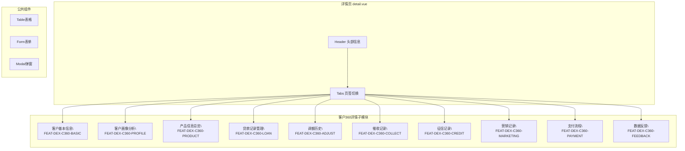
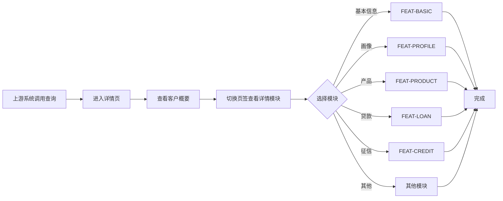

---
neo4j:
  epic: "Epic:EPIC-DEX-CUSTOMER_360"
  feature: "FEAT-DEX-C360-DETAIL"
feishu:
  wiki: "V8KEfpg1vlkCZld"
doc:
  title: "客户360详情 Feature说明文档"
  version: "v3.0"
  status: "completed"
  productDomain: "PD-DEX"
  epicKey: "EPIC-DEX-CUSTOMER_360"
  author: "Tony Stark"
  createdAt: "2026-04-24"
  updatedAt: "2026-04-29"
---

# FEAT-DEX-C360-DETAIL - 客户360详情

> **版本**: v3.0
> **日期**: 2026-04-29
> **作者**: Tony Stark
> **状态**: completed

---

## 1. Feature 基本信息

| 字段 | 内容 |
|:---|:---|
| Feature ID | FEAT-DEX-C360-DETAIL |
| Feature URI | `Feature:FEAT-DEX-C360-DETAIL` |
| Feature 名称 | 客户360详情 |
| 所属 Epic | EPIC-DEX-CUSTOMER_360 客户360全景能力 |
| 所属产品域 | PD-DEX 数据探索 |
| 负责人 | Tony Stark |
| Story数 | 4 |

---

## 2. Feature 概述

### 2.1 是什么
客户360详情页聚合展示客户的全方位信息，支撑客服系统和人工审批系统的查询需求。详情页整合以下子模块数据：

- 客户基本信息（基础信息、账户概览）
- 客户画像分析（人口统计、行为、消费、风险、产品偏好、营销响应）
- 产品信息（授信明细、借据详情）
- 贷款记录（还款明细、还款计划、放款记录）
- 调额历史、催收记录、征信记录
- 营销记录（触达记录、权益发放、营销效果）
- 支付流程（签约记录、还款记录）
- 数据反馈

### 2.2 解决什么问题
- 客服/审批人员需要在一个页面看到客户的完整信息
- 各维度数据分散，缺乏统一视图
- 无法快速支撑客服和审批决策

### 2.3 用户场景

| 场景 | 用户 | 描述 |
|:---|:---|:---|
| 客服查询 | 客服人员 | 查询客户信息进行业务处理 |
| 审批查询 | 审批人员 | 查询客户信息进行审批决策 |
| 客户确认 | 客服人员 | 核对客户身份和账户状态 |

---

## 3. 系统模块图（页面/组件结构）

### 3.1 页面说明

| 页面 | 路由 | 组件 | 说明 |
|:---|:---|:---|:---|
| 客户360详情 | /discovery/customer360/detail | detail.vue | 详情主页面，通过页签切换展示各模块 |

### 3.2 详情子模块说明

| 模块 | Feature | 说明 |
|:---|:---|:---|
| 客户基本信息 | FEAT-DEX-C360-BASIC | 基础信息+账户概览 |
| 客户画像分析 | FEAT-DEX-C360-PROFILE | 人口/行为/消费/风险特征 |
| 产品信息总览 | FEAT-DEX-C360-PRODUCT | 授信明细+借据详情 |
| 贷款记录管理 | FEAT-DEX-C360-LOAN | 还款明细+还款计划+放款记录 |
| 调额历史 | FEAT-DEX-C360-ADJUST | 额度调整历史 |
| 催收记录 | FEAT-DEX-C360-COLLECT | 催收详情+跟进记录 |
| 征信记录 | FEAT-DEX-C360-CREDIT | 征信报告查询展示 |
| 营销记录 | FEAT-DEX-C360-MARKETING | 触达+权益+效果分析 |
| 支付流程 | FEAT-DEX-C360-PAYMENT | 签约+还款记录 |
| 数据反馈 | FEAT-DEX-C360-FEEDBACK | 问题反馈入口 |

---

## 4. 功能说明

### 4.1 功能清单

| 功能点 | 类型 | 描述 |
|:---|:---|:---|
| FP-001 | 页面 | 详情头部信息，展示客户基础概要 |
| FP-002 | 页面 | 页签切换，支持按模块切换展示 |
| FP-003 | 页面 | 客户基本信息展示模块 |
| FP-004 | 页面 | 客户画像分析展示模块 |
| FP-005 | 页面 | 产品信息总览展示模块 |
| FP-006 | 页面 | 贷款记录管理展示模块 |
| FP-007 | 页面 | 调额历史展示模块 |
| FP-008 | 页面 | 催收记录展示模块 |
| FP-009 | 页面 | 征信记录展示模块 |
| FP-010 | 页面 | 营销记录展示模块 |
| FP-011 | 页面 | 支付流程展示模块 |
| FP-012 | 页面 | 数据反馈入口模块 |

### 4.2 用户流程

---

## 5. 验收标准

| 验收项 | 标准 |
|:---|:---|
| 功能验收 | 详情页正常加载，展示客户概要信息 |
| 功能验收 | 各页签模块正常切换，数据展示完整 |
| 功能验收 | 子模块数据加载正常，无异常 |
| 交互验收 | 页签切换流畅，无白屏 |
| 性能验收 | 详情页加载时间≤3s |

---

## 6. 依赖关系

| 依赖项 | 类型 | 说明 |
|:---|:---|:---|
| FEAT-DEX-C360-BASIC | Feature | 客户基本信息子模块 |
| FEAT-DEX-C360-PROFILE | Feature | 客户画像分析子模块 |
| FEAT-DEX-C360-PRODUCT | Feature | 产品信息总览子模块 |
| FEAT-DEX-C360-LOAN | Feature | 贷款记录管理子模块 |
| FEAT-DEX-C360-CREDIT | Feature | 征信记录子模块 |

---

## 7. 变更记录

| 日期 | 版本 | 变更内容 | 作者 |
|:---|:---:|:---|:---|
| 2026-04-24 | v2.0 | 基于 Neo4j 交叉核验后重建 | Tony Stark |
| 2026-04-26 | v2.3 | 标注暂无PRD依据 | Tony Stark |
| 2026-04-29 | v3.0 | 明确详情页整合14个子模块，添加frontmatter | Tony Stark |

---

🦈 *Feature 说明文档 v3.0 - 2026-04-29*
