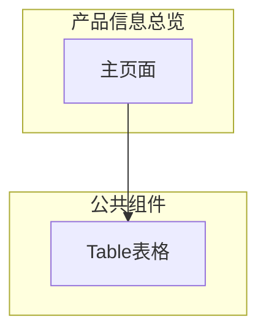

---
neo4j:
  epic: "Epic:EPIC-DEX-CUSTOMER_360"
  feature: "FEAT-DEX-C360-PRODUCT"
feishu:
  wiki: "V8KEfpg1vlkCZld"
doc:
  title: "产品信息总览 Feature说明文档"
  version: "v1.0"
  status: "backlog"
  productDomain: "PD-DEX"
  epicKey: "EPIC-DEX-CUSTOMER_360"
  author: "Tony Stark"
  createdAt: "2026-04-29"
  updatedAt: "2026-04-29"
---

# FEAT-DEX-C360-PRODUCT - 产品信息总览

> **版本**: v1.0
> **日期**: 2026-04-29
> **作者**: Tony Stark
> **状态**: backlog

---

## 1. Feature 基本信息

| 字段 | 内容 |
|:---|:---|
| Feature ID | FEAT-DEX-C360-PRODUCT |
| Feature URI | Feature:FEAT-DEX-C360-PRODUCT |
| Feature 名称 | 产品信息总览 |
| 所属 Epic | EPIC-DEX-CUSTOMER_360 客户360全景能力 |
| 所属产品域 | PD-DEX 数据探索 |
| 负责人 | Tony Stark |
| Story数 | 2 |

---

## 2. Feature 概述

### 2.1 是什么
产品信息总览模块展示客户持有的所有产品及授信明细，支持搜索、筛选、分页。

### 2.2 解决什么问题
- 功能模块开发中，待补充具体痛点

### 2.3 用户场景

| 场景 | 用户 | 描述 |
|:---|:---|:---|
| 场景1 | 业务人员 | 查看客户持有产品的授信明细列表（产品名称、状态、授信金额、已用金额） |
| 场景2 | 风控人员 | 查看借据详情抽屉，分析客户的负债情况和还款记录 |
| 场景3 | 客服人员 | 通过搜索和状态筛选过滤客户的产品列表，快速定位目标产品 |

---

## 3. 系统模块图（页面/组件结构）

### 3.1 页面说明

| 页面 | 路由 | 组件 | 说明 |
|:---|:---|:---|:---|
| 产品信息总览 | /discovery/customer360/detail | 产品信息总览Page | 主功能页 |

### 3.2 组件说明

| 组件 | 类型 | 说明 |
|:---|:---|:---|
| Table | 公共 | 通用表格组件 |

---

## 4. 功能说明

### 4.1 功能清单

| 功能点 | 类型 | 描述 |
|:---|:---|:---|
| FP-001 | 页面 | 授信明细列表 |
| FP-002 | 页面 | 借据详情 |

### 4.2 用户流程

---

## 5. 验收标准

| 验收项 | 标准 |
|:---|:---|
| 功能验收 | 功能正常展示和操作 |
| 交互验收 | 交互符合预期 |
| 性能验收 | 页面加载2秒以内 |

---

## 6. 依赖关系

| 依赖项 | 类型 | 说明 |
|:---|:---|:---|
| 信贷系统 | 数据依赖 | 授信明细、借据详情来自核心信贷系统 |
| 账户系统 | 数据依赖 | 产品状态、授信/已用/可用金额来自账户服务 |

---

## 7. 变更记录

| 日期 | 版本 | 变更内容 | 作者 |
|:---|:---:|:---|:---|
| 2026-04-29 | v1.0 | 新建，基于功能清单同步 | Tony Stark |

---

🦈 *Feature 说明文档 v1.0 - 2026-04-29*
