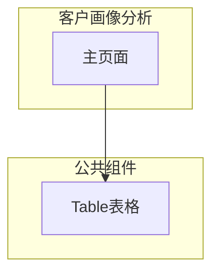

---
neo4j:
  epic: "Epic:EPIC-DEX-CUSTOMER_360"
  feature: "FEAT-DEX-C360-PROFILE"
feishu:
  wiki: "V8KEfpg1vlkCZld"
doc:
  title: "客户画像分析 Feature说明文档"
  version: "v1.0"
  status: "backlog"
  productDomain: "PD-DEX"
  epicKey: "EPIC-DEX-CUSTOMER_360"
  author: "Tony Stark"
  createdAt: "2026-04-29"
  updatedAt: "2026-04-29"
---

# FEAT-DEX-C360-PROFILE - 客户画像分析

> **版本**: v1.0
> **日期**: 2026-04-29
> **作者**: Tony Stark
> **状态**: backlog

---

## 1. Feature 基本信息

| 字段 | 内容 |
|:---|:---|
| Feature ID | FEAT-DEX-C360-PROFILE |
| Feature URI | Feature:FEAT-DEX-C360-PROFILE |
| Feature 名称 | 客户画像分析 |
| 所属 Epic | EPIC-DEX-CUSTOMER_360 客户360全景能力 |
| 所属产品域 | PD-DEX 数据探索 |
| 负责人 | Tony Stark |
| Story数 | 3 |

---

## 2. Feature 概述

### 2.1 是什么
客户画像分析模块提供客户的多维度画像，包含人口统计特征、行为特征、消费与风险特征等。

### 2.2 解决什么问题
- 功能模块开发中，待补充具体痛点

### 2.3 用户场景

| 场景 | 用户 | 描述 |
|:---|:---|:---|
| 场景1 | 业务人员 | 查看客户人口统计特征（年龄段、地域、职业类别、收入水平） |
| 场景2 | 风控人员 | 查看客户行为特征和消费特征，评估客户风险偏好 |
| 场景3 | 风控人员 | 查看客户风险特征（信用等级、还款能力、风险类型）辅助风控决策 |
| 场景4 | 业务人员 | 查看客户产品偏好和营销响应特征，辅助精准营销决策 |

---

## 3. 系统模块图（页面/组件结构）

### 3.1 页面说明

| 页面 | 路由 | 组件 | 说明 |
|:---|:---|:---|:---|
| 客户画像分析 | /discovery/customer360/detail | 客户画像分析Page | 主功能页 |

### 3.2 组件说明

| 组件 | 类型 | 说明 |
|:---|:---|:---|
| Table | 公共 | 通用表格组件 |

---

## 4. 功能说明

### 4.1 功能清单

| 功能点 | 类型 | 描述 |
|:---|:---|:---|
| FP-001 | 页面 | 人口统计特征 |
| FP-002 | 页面 | 行为特征 |
| FP-003 | 页面 | 消费与风险特征 |

### 4.2 用户流程

---

## 5. 验收标准

| 验收项 | 标准 |
|:---|:---|
| 功能验收 | 功能正常展示和操作 |
| 交互验收 | 交互符合预期 |
| 性能验收 | 页面加载2秒以内 |

---

## 6. 依赖关系

| 依赖项 | 类型 | 说明 |
|:---|:---|:---|
| 数据中台 | 数据依赖 | 人口统计特征（地域、职业）来自数据中台画像服务 |
| 行为分析平台 | 数据依赖 | 行为特征、活跃度数据来自行为埋点系统 |
| 营销系统 | 数据依赖 | 消费能力、营销响应数据来自营销模块 |

---

## 7. 变更记录

| 日期 | 版本 | 变更内容 | 作者 |
|:---|:---:|:---|:---|
| 2026-04-29 | v1.0 | 新建，基于功能清单同步 | Tony Stark |

---

🦈 *Feature 说明文档 v1.0 - 2026-04-29*
