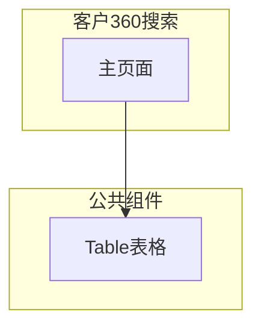

---
neo4j:
  epic: "Epic:EPIC-DEX-CUSTOMER_360"
  feature: "FEAT-DEX-C360-SEARCH"
feishu:
  wiki: "V8KEfpg1vlkCZld"
doc:
  title: "客户360搜索 Feature说明文档"
  version: "v1.0"
  status: "completed"
  productDomain: "PD-DEX"
  epicKey: "EPIC-DEX-CUSTOMER_360"
  author: "Tony Stark"
  createdAt: "2026-04-29"
  updatedAt: "2026-04-29"
---

# FEAT-DEX-C360-SEARCH - 客户360搜索

> **版本**: v1.0
> **日期**: 2026-04-29
> **作者**: Tony Stark
> **状态**: completed

---

## 1. Feature 基本信息

| 字段 | 内容 |
|:---|:---|
| Feature ID | FEAT-DEX-C360-SEARCH |
| Feature URI | Feature:FEAT-DEX-C360-SEARCH |
| Feature 名称 | 客户360搜索 |
| 所属 Epic | EPIC-DEX-CUSTOMER_360 客户360全景能力 |
| 所属产品域 | PD-DEX 数据探索 |
| 负责人 | Tony Stark |
| Story数 | 4 |

---

## 2. Feature 概述

### 2.1 是什么
客户360搜索模块提供客户信息的查询入口，支持精确搜索和模糊搜索，快速定位目标客户并跳转详情页。

### 2.2 解决什么问题
- 功能模块开发中，待补充具体痛点

### 2.3 用户场景

| 场景 | 用户 | 描述 |
|:---|:---|:---|
| 场景1 | 业务人员/客服人员 | 使用精确搜索，通过客户ID快速定位目标客户，查看客户信息 |
| 场景2 | 业务人员 | 使用模糊搜索，通过姓名+身份证后6位组合查询找到目标客户 |
| 场景3 | 客服人员 | 从模糊搜索列表中选择目标客户，点击进入详情页 |
| 场景4 | 业务人员 | 搜索结果唯一时，等待3秒自动跳转详情页，或手动取消 |

---

## 3. 系统模块图（页面/组件结构）

### 3.1 页面说明

| 页面 | 路由 | 组件 | 说明 |
|:---|:---|:---|:---|
| 客户360搜索 | /discovery/customer360/detail | 客户360搜索Page | 主功能页 |

### 3.2 组件说明

| 组件 | 类型 | 说明 |
|:---|:---|:---|
| Table | 公共 | 通用表格组件 |

---

## 4. 功能说明

### 4.1 功能清单

| 功能点 | 类型 | 描述 |
|:---|:---|:---|
| FP-001 | 页面 | 客户搜索 |
| FP-002 | 页面 | 搜索结果 |
| FP-003 | 页面 | 精确搜索 |
| FP-004 | 页面 | 模糊搜索 |

### 4.2 用户流程

---

## 5. 验收标准

| 验收项 | 标准 |
|:---|:---|
| 功能验收 | 功能正常展示和操作 |
| 交互验收 | 交互符合预期 |
| 性能验收 | 页面加载2秒以内 |

---

## 6. 依赖关系

| 依赖项 | 类型 | 说明 |
|:---|:---|:---|
| 客户中心 | 数据依赖 | 精确/模糊搜索依赖客户基础信息查询接口 |
| 身份认证服务 | 接口依赖 | 搜索功能需校验用户身份与权限 |

---

## 7. 变更记录

| 日期 | 版本 | 变更内容 | 作者 |
|:---|:---:|:---|:---|
| 2026-04-29 | v1.0 | 新建，基于功能清单同步 | Tony Stark |

---

🦈 *Feature 说明文档 v1.0 - 2026-04-29*
