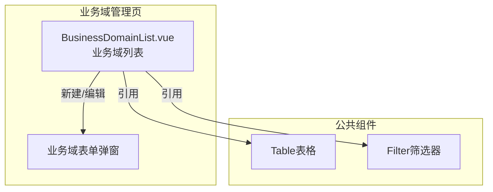
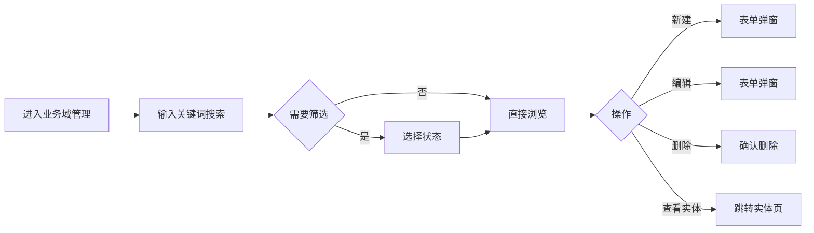

---
neo4j:
  feature: "FEAT-DMT-BC-DOMAIN"
feishu:
  wiki: "V8KEfpg1vlkCZld"
doc:
  title: "FEAT-DMT-BC-DOMAIN业务域管理-Feature说明文档"
  version: "v1.0"
  type: "Feature说明文档"
  productDomain: "PD-DMT"
  epicKey: "Epic:EPIC-DMT-BC"
  featureKey: "FEAT-DMT-BC-DOMAIN"
  author: "Tony Stark"
  createdAt: "2026-04-30"
  updatedAt: "2026-04-30"
---

# FEAT-DMT-BC-DOMAIN - 业务域管理

> **版本**: v1.0
> **日期**: 2026-04-30
> **作者**: Tony Stark
> **状态**: 已完成

---

## 1. Feature 基本信息

| 字段 | 内容 |
|:---|:---|
| Feature ID | FEAT-DMT-BC-DOMAIN |
| Feature 名称 | 业务域管理 |
| 所属 EPIC | EPIC-DMT-BC 业务数据目录 |
| 所属产品域 | PD-DMT 数据管理 |
| 负责人 | Tony Stark |

---

## 2. Feature 概述

### 2.1 是什么
业务域是业务数据的顶层分类结构，用于组织和划分不同业务领域的数据资产。

### 2.2 解决什么问题
- 缺乏统一的业务域划分标准
- 数据资产难以按业务分类组织
- 业务域与数据实体的关系不清晰

### 2.3 用户场景

| 场景 | 用户 | 描述 |
|:---|:---|:---|
| 业务域检索 | 数据分析师 | 通过名称搜索目标业务域 |
| 状态筛选 | 数据开发者 | 按状态（启用/停用）筛选 |
| 实体查看 | 数据管理员 | 查看域下的实体列表 |

---

## 3. 系统模块图

### 3.1 页面说明

| 页面 | 路由 | 组件 | 说明 |
|:---|:---|:---|:---|
| 业务域管理 | /management/business-domain | BusinessDomainList.vue | 业务域管理页 |

### 3.2 组件说明

| 组件 | 类型 | 说明 |
|:---|:---|:---|
| Table | 公共 | 列表展示组件 |
| Filter | 业务 | 筛选器组件 |

---

## 4. 功能说明

### 4.1 功能清单

| 功能点 | 类型 | 描述 |
|:---|:---|:---|
| FP-001 | 页面 | 业务域检索，按名称模糊匹配。**筛选器**：业务域名称文本(模糊匹配)、状态下拉(启用/停用) |
| FP-002 | 页面 | 新建业务域，创建新的业务域。**交互**：点击"新建"按钮弹出表单，**必填**：业务域编码、业务域名称 |
| FP-003 | 页面 | 编辑业务域，修改业务域信息。**交互**：点击"编辑"按钮弹出表单，预填充现有数据 |
| FP-004 | 页面 | 删除业务域，删除业务域。**交互**：点击"删除"按钮，**前置条件**：域下无实体时才能删除 |
| FP-005 | 页面 | 查看实体，查看域下的实体列表。**交互**：点击"查看实体"按钮跳转业务实体管理页 |

### 4.2 用户流程

---

## 5. 验收标准

| 验收项 | 标准 |
|:---|:---|
| 功能验收 | 业务域检索支持名称模糊匹配 |
| 功能验收 | 状态筛选正确区分启用/停用状态 |
| 功能验收 | 新建业务域必填字段：业务域编码、业务域名称 |
| 功能验收 | 编辑业务域预填充现有数据 |
| 功能验收 | 删除业务域需确认，域下有实体时不可删除 |
| 功能验收 | 查看实体跳转至业务实体管理页并筛选当前域 |
| 功能验收 | 列表支持分页 |
| 交互验收 | 筛选条件变更后自动刷新列表 |
| 性能验收 | 页面加载时间≤2s |

---

## 6. 依赖关系

| 依赖项 | 类型 | 说明 |
|:---|:---|:---|
| 无 | - | 业务域是顶层结构，不依赖其他模块 |

---

## 7. 变更记录

| 日期 | 版本 | 变更内容 | 作者 |
|:---|:---:|:---|:---|
| 2026-04-30 | v1.0 | 初始版本，按功能清单模块重新梳理，符合模板v1.2 | Tony Stark |

---

🦾 *Feature说明文档 v1.0 - 业务域管理*