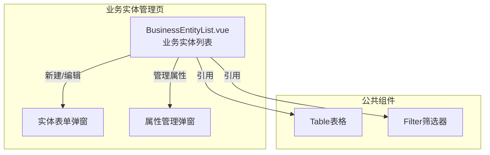
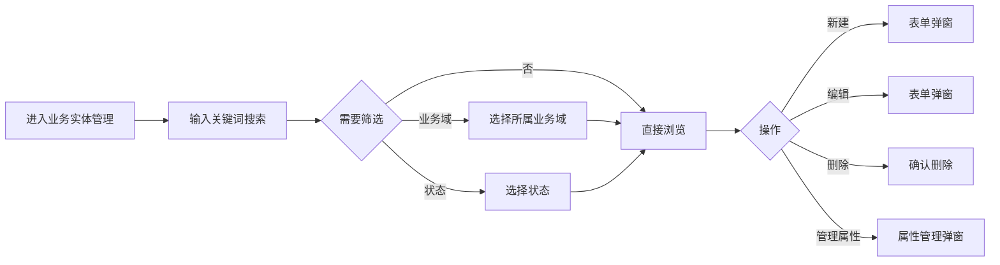

---
neo4j:
  feature: "FEAT-DMT-BC-ENTITY"
feishu:
  wiki: "V8KEfpg1vlkCZld"
doc:
  title: "FEAT-DMT-BC-ENTITY业务实体管理-Feature说明文档"
  version: "v1.0"
  type: "Feature说明文档"
  productDomain: "PD-DMT"
  epicKey: "Epic:EPIC-DMT-BC"
  featureKey: "FEAT-DMT-BC-ENTITY"
  author: "Tony Stark"
  createdAt: "2026-04-30"
  updatedAt: "2026-04-30"
---

# FEAT-DMT-BC-ENTITY - 业务实体管理

> **版本**: v1.0
> **日期**: 2026-04-30
> **作者**: Tony Stark
> **状态**: 已完成

---

## 1. Feature 基本信息

| 字段 | 内容 |
|:---|:---|
| Feature ID | FEAT-DMT-BC-ENTITY |
| Feature 名称 | 业务实体管理 |
| 所属 EPIC | EPIC-DMT-BC 业务数据目录 |
| 所属产品域 | PD-DMT 数据管理 |
| 负责人 | Tony Stark |

---

## 2. Feature 概述

### 2.1 是什么
业务实体是业务域下的具体业务对象，如客户、订单、产品等，是业务语义的核心载体。

### 2.2 解决什么问题
- 缺乏统一的业务实体定义
- 不知道实体的属性和关系
- 实体与业务域的归属不清晰

### 2.3 用户场景

| 场景 | 用户 | 描述 |
|:---|:---|:---|
| 实体检索 | 数据分析师 | 通过名称搜索目标实体 |
| 业务域筛选 | 数据开发者 | 按所属业务域筛选 |
| 属性管理 | 数据管理员 | 管理实体的属性 |

---

## 3. 系统模块图

### 3.1 页面说明

| 页面 | 路由 | 组件 | 说明 |
|:---|:---|:---|:---|
| 业务实体管理 | /management/business-entity | BusinessEntityList.vue | 业务实体管理页 |

### 3.2 组件说明

| 组件 | 类型 | 说明 |
|:---|:---|:---|
| Table | 公共 | 列表展示组件 |
| Filter | 业务 | 筛选器组件 |

---

## 4. 功能说明

### 4.1 功能清单

| 功能点 | 类型 | 描述 |
|:---|:---|:---|
| FP-001 | 页面 | 实体检索，按名称模糊匹配。**筛选器**：实体名称文本(模糊匹配)、所属业务域下拉(启用/停用) |
| FP-002 | 页面 | 新建实体，创建新的业务实体。**交互**：点击"新建"按钮弹出表单，**必填**：实体编码、实体名称、所属业务域 |
| FP-003 | 页面 | 编辑实体，修改实体信息。**交互**：点击"编辑"按钮弹出表单，预填充现有数据 |
| FP-004 | 页面 | 删除实体，删除业务实体。**交互**：点击"删除"按钮，**前置条件**：无关联数据时才能删除 |
| FP-005 | 页面 | 管理属性，管理实体的属性。**交互**：点击"管理属性"按钮弹出属性管理弹窗，**属性类型**：主实体/衍生实体 |

### 4.2 用户流程

---

## 5. 验收标准

| 验收项 | 标准 |
|:---|:---|
| 功能验收 | 实体检索支持名称模糊匹配 |
| 功能验收 | 所属业务域筛选支持下拉选择 |
| 功能验收 | 状态筛选正确区分启用/停用状态 |
| 功能验收 | 新建实体必填字段：实体编码、实体名称、所属业务域 |
| 功能验收 | 编辑实体预填充现有数据 |
| 功能验收 | 删除实体需确认，无关联数据时才能删除 |
| 功能验收 | 属性管理弹窗支持属性类型区分（主实体/衍生实体） |
| 功能验收 | 列表支持分页 |
| 交互验收 | 筛选条件变更后自动刷新列表 |
| 性能验收 | 页面加载时间≤2s |

---

## 6. 依赖关系

| 依赖项 | 类型 | 说明 |
|:---|:---|:---|
| FEAT-DMT-BC-DOMAIN | 上游 | 业务实体归属业务域，依赖业务域数据 |

---

## 7. 变更记录

| 日期 | 版本 | 变更内容 | 作者 |
|:---|:---:|:---|:---|
| 2026-04-30 | v1.0 | 初始版本，按功能清单模块重新梳理，符合模板v1.2 | Tony Stark |

---

🦾 *Feature说明文档 v1.0 - 业务实体管理*