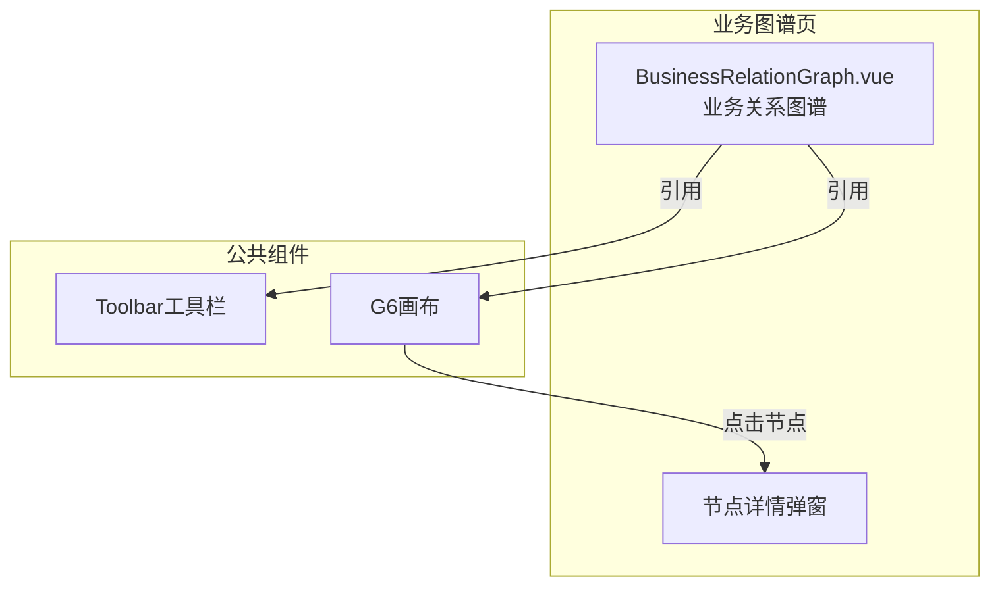
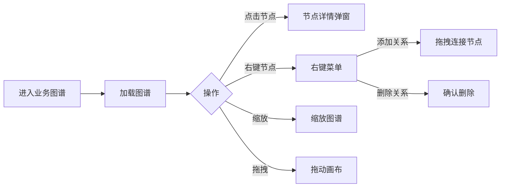

---
neo4j:
  feature: "FEAT-DMT-BC-GRAPH"
feishu:
  wiki: "V8KEfpg1vlkCZld"
doc:
  title: "FEAT-DMT-BC-GRAPH业务图谱-Feature说明文档"
  version: "v1.0"
  type: "Feature说明文档"
  productDomain: "PD-DMT"
  epicKey: "Epic:EPIC-DMT-BC"
  featureKey: "FEAT-DMT-BC-GRAPH"
  author: "Tony Stark"
  createdAt: "2026-04-30"
  updatedAt: "2026-04-30"
---

# FEAT-DMT-BC-GRAPH - 业务图谱

> **版本**: v1.0
> **日期**: 2026-04-30
> **作者**: Tony Stark
> **状态**: 已完成

---

## 1. Feature 基本信息

| 字段 | 内容 |
|:---|:---|
| Feature ID | FEAT-DMT-BC-GRAPH |
| Feature 名称 | 业务图谱 |
| 所属 EPIC | EPIC-DMT-BC 业务数据目录 |
| 所属产品域 | PD-DMT 数据管理 |
| 负责人 | Tony Stark |

---

## 2. Feature 概述

### 2.1 是什么
业务实体之间的关系可视化展示，支持查看和管理业务实体间的关联关系。

### 2.2 解决什么问题
- 实体关系难以直观理解
- 不知道实体之间的上下游依赖
- 缺乏可视化的关系探索工具

### 2.3 用户场景

| 场景 | 用户 | 描述 |
|:---|:---|:---|
| 关系探索 | 数据分析师 | 可视化查看实体关系 |
| 关系管理 | 数据管理员 | 添加/删除实体间关系 |
| 图谱操作 | 数据开发者 | 缩放、移动图谱 |

---

## 3. 系统模块图

### 3.1 页面说明

| 页面 | 路由 | 组件 | 说明 |
|:---|:---|:---|:---|
| 业务图谱 | /management/business-graph | BusinessRelationGraph.vue | 业务关系可视化页 |

### 3.2 组件说明

| 组件 | 类型 | 说明 |
|:---|:---|:---|
| Toolbar | 公共 | 工具栏组件 |
| G6 | 业务 | 图谱可视化组件（AntV G6） |

---

## 4. 功能说明

### 4.1 功能清单

| 功能点 | 类型 | 描述 |
|:---|:---|:---|
| FP-001 | 页面 | 查看节点，查看节点详情。**交互**：点击节点弹出详情弹窗，**节点颜色**：业务域(蓝色)、业务实体(绿色) |
| FP-002 | 页面 | 添加关系，创建实体间关系。**交互**：右键菜单选择"添加关系"，拖拽连接两个节点 |
| FP-003 | 页面 | 删除关系，删除实体间关系。**交互**：右键菜单选择"删除关系"，**确认**：需二次确认 |
| FP-004 | 页面 | 图谱操作，支持缩放和拖拽。**交互**：工具栏按钮或鼠标滚轮缩放，按住拖动画布 |

### 4.2 用户流程

---

## 5. 验收标准

| 验收项 | 标准 |
|:---|:---|
| 功能验收 | 节点颜色正确区分业务域(蓝色)和业务实体(绿色) |
| 功能验收 | 点击节点弹出详情弹窗 |
| 功能验收 | 右键菜单支持添加关系和删除关系 |
| 功能验收 | 删除关系需要二次确认 |
| 功能验收 | 图谱支持缩放（鼠标滚轮/工具栏按钮） |
| 功能验收 | 图谱支持拖拽（按住拖动） |
| 交互验收 | 图谱加载流畅，无明显卡顿 |
| 性能验收 | 图谱渲染时间≤3s |

---

## 6. 依赖关系

| 依赖项 | 类型 | 说明 |
|:---|:---|:---|
| FEAT-DMT-BC-DOMAIN | 上游 | 图谱节点包含业务域 |
| FEAT-DMT-BC-ENTITY | 上游 | 图谱节点包含业务实体 |

---

## 7. 变更记录

| 日期 | 版本 | 变更内容 | 作者 |
|:---|:---:|:---|:---|
| 2026-04-30 | v1.0 | 初始版本，按功能清单模块重新梳理，符合模板v1.2 | Tony Stark |

---

🦾 *Feature说明文档 v1.0 - 业务图谱*