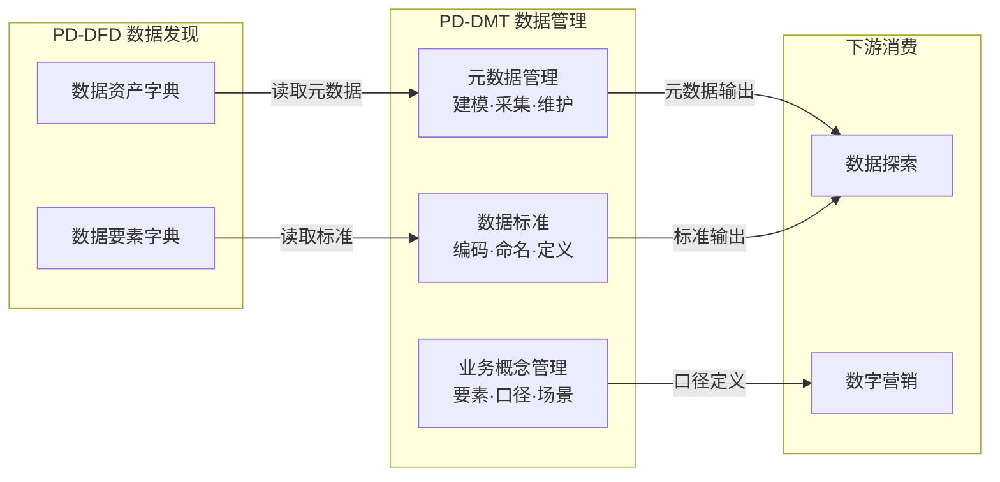
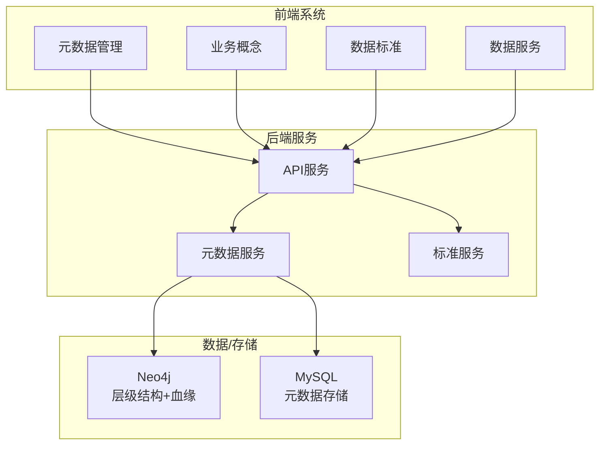

# 产品域说明文档模板

> **版本**: v1.3
> **日期**: 2026-05-06
> **作者**: Tony Stark
> **状态**: 规划中

---

## 1. 产品域概述

### 1.1 基本信息

| 字段 | 内容 |
|:---|:---|
| 产品域 ID | PD-DMT |
| 产品域名称 | 数据管理 |
| 英文名 | Data Management |
| 所属业务线 | 数字社区 |
| 产品负责人 | Tony Stark |
| 创建日期 | 2026-04-24 |

### 1.2 产品域定位

**治理层** - 数据资产的标准化管理和质量管控平台

PD-DMT 是面向消费金融业务场景的数据治理平台，为数据资产提供标准定义、质量管控、元数据维护的能力。

### 1.3 核心价值

| 价值维度 | 说明 |
|:---|:---|
| 用户价值 | 统一数据标准，降低数据理解成本 |
| 业务价值 | 建立数据质量管控体系，保障数据资产可信 |
| 技术价值 | 统一元数据管理，支持数据血缘追溯 |

---

## 2. 逻辑架构图（业务流程）

> **用途**：描述业务域之间的流程流转，供产品/运营/业务方理解
> **关注点**：业务流程、活动流转、数据流向
> **特点**：无系统边界概念，关注"做什么"

### 2.1 逻辑层级说明

| 层级 | Epic/模块 | 业务流程 | 说明 |
|:---|:---|:---|:---|
| 标准层 | 数据标准 | 编码规则、命名规范、口径定义 | 规则制定，向上游输出 |
| 元数据层 | 元数据管理 | 建模、采集、版本管理 | 资产维护，向下游输出 |
| 概念层 | 业务概念管理 | 要素定义、口径说明 | 业务抽象，统一语言 |

---

## 3. 物理架构图（系统模块）

> **用途**：描述系统模块之间的调用关系，供开发/测试/架构师理解
> **关注点**：系统边界、模块间调用、数据流
> **特点**：有明确的技术实现和系统边界

### 3.1 系统模块说明

| 模块 | 类型 | 说明 |
|:---|:---|:---|
| 元数据管理 | 前端 | 元数据建模、采集、版本管理 |
| 业务概念 | 前端 | 要素定义、口径管理 |
| 数据标准 | 前端 | 标准编码、命名规范 |
| 数据服务 | 前端 | 服务目录、权限授权 |
| API服务 | 后端 | 统一API网关 |
| 元数据服务 | 后端 | 元数据管理和血缘计算 |
| 标准服务 | 后端 | 标准规则引擎 |

---

## 4. Epic 列表

| 序号 | Epic ID | Epic 名称 | Feature 数量 |
|:---:|:---|:---|:---:|
| 1 | EPIC-DMT-META | 元数据管理 | 15 |
| 2 | EPIC-DMT-BC | 业务概念管理 | 3 |
| 3 | EPIC-DMT-STD | 数据标准 | 15 |
| 4 | EPIC-DMT-SVC | 数据服务 | 40 |

### 4.1 Epic 详细

#### EPIC-DMT-META 元数据管理

| 属性 | 值 |
|:---|:---|
| Epic ID | EPIC-DMT-META |
| Epic 名称 | 元数据管理 |
| 目标 | 管理数据资产的元信息，包括表结构、字段、血缘等 |
| 负责人 | Tony Stark |

**Feature 列表**：
| Feature | 名称 | 优先级 |
|:---|:---|:---:|
| FEAT-DMT-META-MODELING | 元数据建模 | P0 |
| FEAT-DMT-META-COLLECT | 元数据采集 | P0 |
| FEAT-DMT-ASSET-MANAGE-TAG | 标签管理 | P1 |
| FEAT-DMT-ELEMENT-LISTING | 要素上下架 | P1 |
| FEAT-DMT-ASSET-LISTING | 资产上下架 | P1 |

---

#### EPIC-DMT-BC 业务概念管理

| 属性 | 值 |
|:---|:---|
| Epic ID | EPIC-DMT-BC |
| Epic 名称 | 业务概念管理 |
| 目标 | 管理业务概念和指标口径，统一数据语言 |
| 负责人 | Tony Stark |

**Feature 列表**：
| Feature | 名称 | 优先级 |
|:---|:---|:---:|
| FEAT-DMT-BC-DOMAIN | 业务域管理 | P1 |
| FEAT-DMT-BC-ENTITY | 业务实体管理 | P1 |
| FEAT-DMT-BC-GRAPH | 业务概念图谱 | P1 |

---

#### EPIC-DMT-STD 数据标准

| 属性 | 值 |
|:---|:---|
| Epic ID | EPIC-DMT-STD |
| Epic 名称 | 数据标准 |
| 目标 | 制定数据标准规范，包括编码规则、命名规范、口径定义 |
| 负责人 | Tony Stark |

**Feature 列表**：
| Feature | 名称 | 优先级 |
|:---|:---|:---:|
| FEAT-DMT-STD-DEFINE | 标准定义 | P0 |
| FEAT-DMT-STD-CODE | 编码规则 | P1 |
| FEAT-DMT-STD-DICT | 标准字典 | P1 |
| FEAT-DMT-STD-CHECK | 标准检查 | P1 |

---

#### EPIC-DMT-SVC 数据服务

| 属性 | 值 |
|:---|:---|
| Epic ID | EPIC-DMT-SVC |
| Epic 名称 | 数据服务 |
| 目标 | 提供数据服务能力，包括目录管理、权限授权、API发布 |
| 负责人 | Tony Stark |

**Feature 列表**：
| Feature | 名称 | 优先级 |
|:---|:---|:---:|
| FEAT-DMT-SVC-CATALOG | 服务目录 | P1 |
| FEAT-DMT-SVC-AUTH | 服务授权 | P1 |
| FEAT-DMT-SVC-QUERY | 服务查询 | P1 |
| FEAT-DMT-SVC-MONITOR | 服务监控 | P1 |

---

## 5. 能力地图

> **用途**：描述产品核心能力矩阵，含关键能力子项、业务价值、建设情况
> **关注点**：能力项与业务价值对应，建设阶段清晰

### 5.1 数据资源管理能力

| 关键能力 | 能力子项 | 业务价值 | 建设情况 |
|:---|:---|:---|:---:|
| 数据资源管理能力 | 数据源管理 | 负责数据源注册、接入配置、资源台账维护，统一数据源头管理，实现全域资源可视、可管 | ⏸️已规划，后期实现 |
| 数据资源管理能力 | 资源生命周期 | 覆盖资源接入、在用、变更、下线全流程维护，规范资源上架与退役流程，避免闲置资源堆积，保障资源有序迭代 | ⏸️已规划，后期实现 |
| 数据资源管理能力 | 资源运维监控 | 提前发现链路问题，保障源头数据稳定供给 | ⏸️已规划，后期实现 |

### 5.2 数据资产管理能力

| 关键能力 | 能力子项 | 业务价值 | 建设情况 |
|:---|:---|:---|:---:|
| 数据资产管理能力 | 元数据管理 | 夯实资产底座，实现数据基础信息可追溯 | 🟡部分实现，建设中 |
| 数据资产管理能力 | 资产分类分级（标签） | 资产结构清晰，便于分层管控与快速查找 | 🟡部分实现，建设中 |
| 数据资产管理能力 | 血缘关系管理 | 支撑变更评估、问题溯源，降低数据变更风险 | 🟡部分实现，建设中 |
| 数据资产管理能力 | 资产运营维护 | 持续保鲜资产质量，提升资产整体可用性 | 🟡部分实现，建设中 |

### 5.3 业务要素管理能力

| 关键能力 | 能力子项 | 业务价值 | 建设情况 |
|:---|:---|:---|:---:|
| 业务要素管理能力 | 业务概念建模 | 把抽象业务逻辑具象化、标准化，形成可复用的业务知识 | ⏸️已规划，后期实现 |
| 业务要素管理能力 | 多维度关联绑定 | 打通业务逻辑与数据层的直接关联，构建 "业务 - 数据" 映射桥梁 | ⏸️已规划，后期实现 |
| 业务要素管理能力 | 业务口径管理 | 保障全域指标口径统一，避免分析结果偏差 | ⏸️已规划，后期实现 |

### 5.4 数据标准管理能力

| 关键能力 | 能力子项 | 业务价值 | 建设情况 |
|:---|:---|:---|:---:|
| 数据标准管理能力 | 规范制度管理 | 统一建设规范，减少数据杂乱无序问题 | ⏸️已规划，后期实现 |
| 数据标准管理能力 | 字典编码管理 | 保证跨业务数据一致性，提升数据互通性 | ⏸️已规划，后期实现 |
| 数据标准管理能力 | 标准落地管控 | 从源头约束数据生产，提升数据规范性 | ⏸️已规划，后期实现 |

### 5.5 日常运维维护能力

| 关键能力 | 能力子项 | 业务价值 | 建设情况 |
|:---|:---|:---|:---:|
| 日常运维维护能力 | 日常信息维护 | 元数据、资产信息、业务文档常态化编辑、更新与修缮，保障数据资料实时准确，减少信息滞后 | 🟡部分实现，建设中 |
| 日常运维维护能力 | 问题闭环管理 | 数据问题收集、分派、整改、归档的全流程维护，常态化治理数据问题，持续优化数据质量 | ⏸️已规划，后期实现 |

### 5.6 数据服务管理能力

| 关键能力 | 能力子项 | 业务价值 | 建设情况 |
|:---|:---|:---|:---:|
| 数据服务管理能力 | 通用数据逻辑维护能力 | 统一沉淀、编辑、复用高频通用数据计算逻辑与公共规则，集中维护管理避免重复开发，统一通用计算口径，降低分析误差 | 🟡部分实现，建设中 |
| 数据服务管理能力 | 数据服务封装能力 | 实现数据能力标准化输出，屏蔽底层技术差异 | ⏸️已规划，后期实现 |

### 5.7 能力地图汇总

| 能力域 | 🟢已实现 | 🟡部分实现 | ⏸️已规划 | 合计 |
|:---|:---:|:---:|:---:|:---:|
| 数据资源管理能力 | 0 | 0 | 3 | 3 |
| 数据资产管理能力 | 0 | 4 | 0 | 4 |
| 业务要素管理能力 | 0 | 0 | 3 | 3 |
| 数据标准管理能力 | 0 | 0 | 3 | 3 |
| 日常运维维护能力 | 0 | 1 | 1 | 2 |
| 数据服务管理能力 | 0 | 1 | 1 | 2 |
| **合计** | **0** | **6** | **11** | **17** |

---

## 6. 菜单结构与功能映射

> **用途**：供技术团队（钟离等）绑定路由和组件

### 5.1 左侧菜单栏

#### （一）数据管理

| 一级菜单 | 二级菜单 | 功能说明 | 权限说明 |
|:---|:---|:---|:---|
| 元数据管理 | - | 元数据建模与采集入口 | 管理员 |
| | 元数据建模 | 表结构、字段定义 | 管理员 |
| | 元数据采集 | 自动采集任务配置 | 管理员 |
| 业务概念 | - | 业务概念管理入口 | 管理员 |
| | 业务域管理 | 业务域定义 | 管理员 |
| | 口径定义 | 指标口径管理 | 管理员 |
| 数据标准 | - | 数据标准管理入口 | 管理员 |
| | 标准字典 | 编码规则字典 | 管理员 |
| | 标准检查 | 命名规范检查 | 管理员 |
| 数据服务 | - | 数据服务管理入口 | 管理员 |
| | 服务目录 | API目录管理 | 管理员 |
| | 服务授权 | 权限授权管理 | 管理员 |

### 5.2 权限说明

| 角色 | 可访问菜单 |
|:---|:---|
| 管理员 | 全部 |
| 普通用户 | 无（后台管理模块） |

---

## 7. 依赖关系

### 6.1 依赖的其他产品域

| 产品域 | 依赖类型 | 说明 |
|:---|:---|:---|
| PD-DFD 数据发现 | 数据依赖 | PD-DMT 提供元数据，PD-DFD 读取展示 |

### 6.2 依赖的外部系统

| 系统 | 依赖类型 | 接口地址 | 说明 |
|:---|:---|:---|:---|
| Neo4j | 数据存储 | localhost:7687 | 存储产品层级结构和血缘关系 |
| MySQL | 数据存储 | - | 存储元数据和配置信息 |

---

## 8. 变更记录

| 日期 | 版本 | 变更内容 | 作者 |
|:---|:---:|:---|:---|
| 2026-05-06 | v1.1 | 新增能力地图模块（6个能力域17项子能力） | Tony Stark |

---

🦍 *PD-DMT 数据管理产品域说明文档 v1.1 - 2026-05-06*