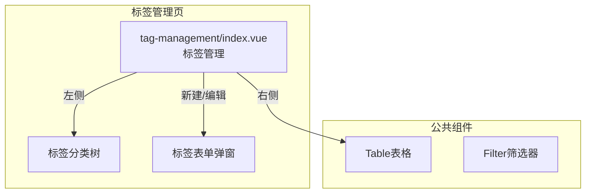
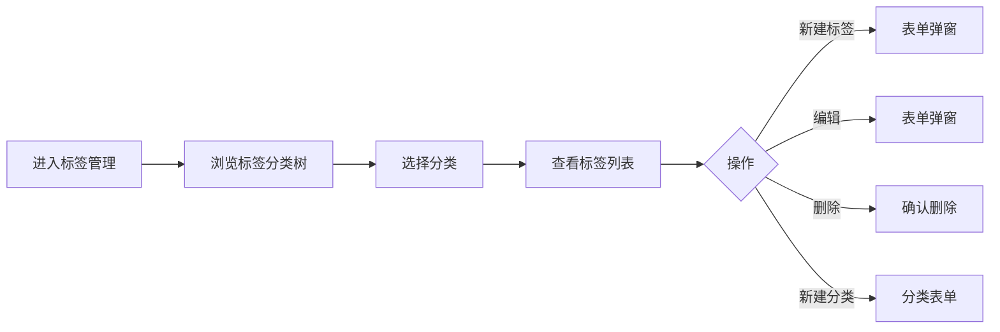

---
neo4j:
  feature: "FEAT-DMT-ASSET-TAG"
feishu:
  wiki: "V8KEfpg1vlkCZld"
doc:
  title: "FEAT-DMT-ASSET-TAG标签管理-Feature说明文档"
  version: "v1.0"
  type: "Feature说明文档"
  productDomain: "PD-DMT"
  epicKey: "Epic:EPIC-DMT-ASSET"
  featureKey: "FEAT-DMT-ASSET-TAG"
  author: "Tony Stark"
  createdAt: "2026-04-30"
  updatedAt: "2026-04-30"
---

# FEAT-DMT-ASSET-TAG - 标签管理

> **版本**: v1.0
> **日期**: 2026-04-30
> **作者**: Tony Stark
> **状态**: 已完成

---

## 1. Feature 基本信息

| 字段 | 内容 |
|:---|:---|
| Feature ID | FEAT-DMT-ASSET-TAG |
| Feature 名称 | 标签管理 |
| 所属 EPIC | EPIC-DMT-ASSET 数据资产管理 |
| 所属产品域 | PD-DMT 数据管理 |
| 负责人 | Tony Stark |

---

## 2. Feature 概述

### 2.1 是什么
统一标签体系管理，支持标签的创建、分类、应用等。

### 2.2 解决什么问题
- 缺乏统一的标签分类体系
- 数据资产难以打标
- 标签使用情况不透明

### 2.3 用户场景

| 场景 | 用户 | 描述 |
|:---|:---|:---|
| 标签检索 | 数据分析师 | 搜索和浏览标签 |
| 分类管理 | 数据管理员 | 管理标签分类 |
| 应用标签 | 数据开发者 | 将标签应用到数据 |

---

## 3. 系统模块图

### 3.1 页面说明

| 页面 | 路由 | 组件 | 说明 |
|:---|:---|:---|:---|
| 标签管理 | /management/asset-management/basic-management/tag-management | tag-management/index.vue | 标签管理页 |

### 3.2 组件说明

| 组件 | 类型 | 说明 |
|:---|:---|:---|
| Table | 公共 | 标签列表组件 |
| Tree | 业务 | 标签分类树组件 |
| Filter | 业务 | 筛选器组件 |

---

## 4. 功能说明

### 4.1 功能清单

| 功能点 | 类型 | 描述 |
|:---|:---|:---|
| FP-001 | 页面 | 标签检索，按名称模糊匹配。**筛选器**：标签名称文本(模糊匹配)、标签分类树形选择、状态下拉(启用/停用) |
| FP-002 | 页面 | 新建标签，创建新的标签。**交互**：点击"新建"按钮弹出表单，**必填**：标签编码、标签名称 |
| FP-003 | 页面 | 编辑标签，修改标签信息。**交互**：点击"编辑"按钮弹出表单，预填充现有数据 |
| FP-004 | 页面 | 删除标签，删除标签。**交互**：点击"删除"按钮，**前置条件**：使用次数为0时才能删除 |
| FP-005 | 页面 | 新建分类，创建新的标签分类。**交互**：点击"新建分类"按钮，**必填**：分类编码、分类名称 |

### 4.2 用户流程

---

## 5. 验收标准

| 验收项 | 标准 |
|:---|:---|
| 功能验收 | 标签检索支持名称模糊匹配 |
| 功能验收 | 分类树正确展示标签分类结构 |
| 功能验收 | 状态筛选正确区分启用/停用 |
| 功能验收 | 新建标签必填：标签编码、标签名称 |
| 功能验收 | 编辑标签预填充现有数据 |
| 功能验收 | 删除标签需确认，使用次数为0时才能删除 |
| 功能验收 | 新建分类必填：分类编码、分类名称 |
| 功能验收 | 列表支持分页 |
| 性能验收 | 页面加载时间≤2s |

---

## 6. 依赖关系

| 依赖项 | 类型 | 说明 |
|:---|:---|:---|
| 无 | - | 标签是独立体系，可被其他模块引用 |

---

## 7. 变更记录

| 日期 | 版本 | 变更内容 | 作者 |
|:---|:---:|:---|:---|
| 2026-04-30 | v1.0 | 初始版本，按功能清单模块重新梳理，符合模板v1.2 | Tony Stark |

---

🦾 *Feature说明文档 v1.0 - 标签管理*