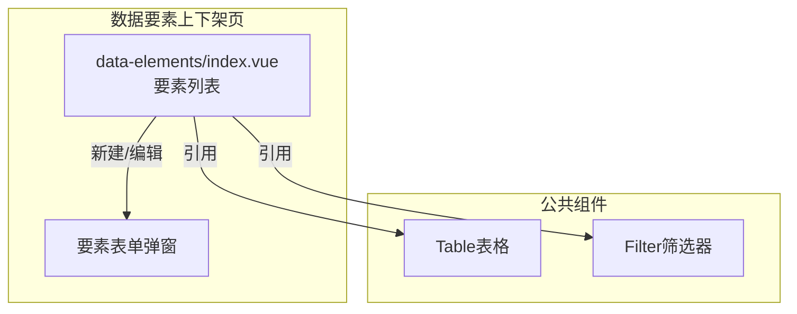
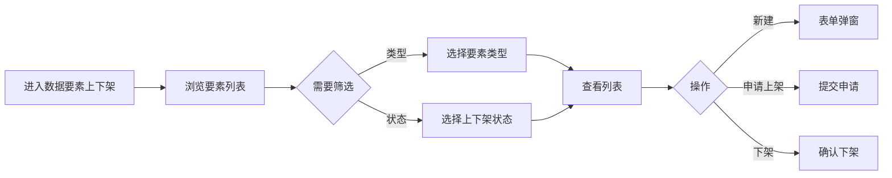

---
neo4j:
  feature: "FEAT-DMT-ELEMENT-LISTING"
feishu:
  wiki: "V8KEfpg1vlkCZld"
doc:
  title: "FEAT-DMT-ELEMENT-LISTING数据要素上下架-Feature说明文档"
  version: "v1.0"
  type: "Feature说明文档"
  productDomain: "PD-DMT"
  epicKey: "Epic:EPIC-DMT-ASSET"
  featureKey: "FEAT-DMT-ELEMENT-LISTING"
  author: "Tony Stark"
  createdAt: "2026-04-30"
  updatedAt: "2026-04-30"
---

# FEAT-DMT-ELEMENT-LISTING - 数据要素上下架

> **版本**: v1.0
> **日期**: 2026-04-30
> **作者**: Tony Stark
> **状态**: 已完成

---

## 1. Feature 基本信息

| 字段 | 内容 |
|:---|:---|
| Feature ID | FEAT-DMT-ELEMENT-LISTING |
| Feature 名称 | 数据要素上下架 |
| 所属 EPIC | EPIC-DMT-ASSET 数据资产管理 |
| 所属产品域 | PD-DMT 数据管理 |
| 负责人 | Tony Stark |

---

## 2. Feature 概述

### 2.1 是什么
数据要素（包括指标、变量、特征等）的上下架管理，控制数据要素的可用性。

### 2.2 解决什么问题
- 数据要素缺乏统一的上架流程
- 要素被引用关系不清晰
- 上下架状态难以追踪

### 2.3 用户场景

| 场景 | 用户 | 描述 |
|:---|:---|:---|
| 要素检索 | 数据分析师 | 搜索和浏览数据要素 |
| 上架申请 | 数据开发者 | 申请发布数据要素 |
| 下架管理 | 数据管理员 | 下架不再使用的要素 |

---

## 3. 系统模块图

### 3.1 页面说明

| 页面 | 路由 | 组件 | 说明 |
|:---|:---|:---|:---|
| 数据要素上下架 | /management/asset-management/data-elements | data-elements/index.vue | 数据要素上下架管理页 |

### 3.2 组件说明

| 组件 | 类型 | 说明 |
|:---|:---|:---|
| Table | 公共 | 列表展示组件 |
| Filter | 业务 | 筛选器组件 |

---

## 4. 功能说明

### 4.1 功能清单

| 功能点 | 类型 | 描述 |
|:---|:---|:---|
| FP-001 | 页面 | 要素检索，按名称模糊匹配。**筛选器**：要素名称文本(模糊匹配)、要素类型下拉(原子指标/派生指标/变量/特征)、上下架状态下拉(已上架/待上架/已下架) |
| FP-002 | 页面 | 新建要素，创建新的数据要素。**交互**：点击"新建"按钮弹出表单，**必填**：要素编码、要素名称、要素类型、计算口径 |
| FP-003 | 页面 | 申请上架，申请发布要素。**交互**：点击"申请上架"按钮，**流程**：申请→审批→开通 |
| FP-004 | 页面 | 下架要素，下架数据要素。**交互**：点击"下架"按钮，**前置条件**：被引用次数为0时才能下架 |

### 4.2 用户流程

---

## 5. 验收标准

| 验收项 | 标准 |
|:---|:---|
| 功能验收 | 要素检索支持名称模糊匹配 |
| 功能验收 | 类型筛选正确区分原子指标/派生指标/变量/特征 |
| 功能验收 | 状态筛选正确区分已上架/待上架/已下架 |
| 功能验收 | 新建要素必填：要素编码、要素名称、要素类型、计算口径 |
| 功能验收 | 申请上架提交后状态变为待上架 |
| 功能验收 | 下架需确认，被引用次数为0时才能下架 |
| 功能验收 | 列表支持分页 |
| 性能验收 | 页面加载时间≤2s |

---

## 6. 依赖关系

| 依赖项 | 类型 | 说明 |
|:---|:---|:---|
| PD-DFD | 下游 | 上架后的要素供 PD-DFD 数据要素市场展示 |

---

## 7. 变更记录

| 日期 | 版本 | 变更内容 | 作者 |
|:---|:---:|:---|:---|
| 2026-04-30 | v1.0 | 初始版本，按功能清单模块重新梳理，符合模板v1.2 | Tony Stark |

---

🦾 *Feature说明文档 v1.0 - 数据要素上下架*