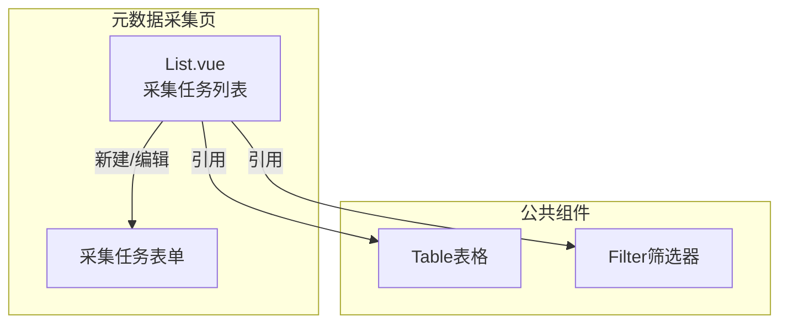
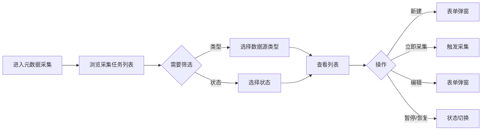

---
neo4j:
  feature: "FEAT-DMT-META-COLLECT"
feishu:
  wiki: "V8KEfpg1vlkCZld"
doc:
  title: "FEAT-DMT-META-COLLECT元数据采集-Feature说明文档"
  version: "v1.0"
  type: "Feature说明文档"
  productDomain: "PD-DMT"
  epicKey: "Epic:EPIC-DMT-ASSET"
  featureKey: "FEAT-DMT-META-COLLECT"
  author: "Tony Stark"
  createdAt: "2026-04-30"
  updatedAt: "2026-04-30"
---

# FEAT-DMT-META-COLLECT - 元数据采集

> **版本**: v1.0
> **日期**: 2026-04-30
> **作者**: Tony Stark
> **状态**: 已完成

---

## 1. Feature 基本信息

| 字段 | 内容 |
|:---|:---|
| Feature ID | FEAT-DMT-META-COLLECT |
| Feature 名称 | 元数据采集 |
| 所属 EPIC | EPIC-DMT-ASSET 数据资产管理 |
| 所属产品域 | PD-DMT 数据管理 |
| 负责人 | Tony Stark |

---

## 2. Feature 概述

### 2.1 是什么
元数据采集管理，支持从各种数据源自动或手动采集元数据，建立统一的数据资产目录。

### 2.2 解决什么问题
- 数据源分散，难以统一管理
- 缺乏自动化的元数据发现能力
- 采集任务状态不透明

### 2.3 用户场景

| 场景 | 用户 | 描述 |
|:---|:---|:---|
| 采集源检索 | 数据工程师 | 搜索和浏览采集数据源 |
| 类型筛选 | 数据开发者 | 按数据源类型筛选 |
| 立即采集 | 数据管理员 | 触发立即采集任务 |

---

## 3. 系统模块图

### 3.1 页面说明

| 页面 | 路由 | 组件 | 说明 |
|:---|:---|:---|:---|
| 元数据采集 | /management/asset-management/basic-management/metadata-collection | List.vue | 元数据采集管理页 |

### 3.2 组件说明

| 组件 | 类型 | 说明 |
|:---|:---|:---|
| Table | 公共 | 列表展示组件 |
| Filter | 业务 | 筛选器组件 |

---

## 4. 功能说明

### 4.1 功能清单

| 功能点 | 类型 | 描述 |
|:---|:---|:---|
| FP-001 | 页面 | 数据源检索，按名称模糊匹配。**筛选器**：数据源名称文本(模糊匹配)、数据源类型下拉(MySQL/Hive/Kafka/API)、状态下拉(采集中/已完成/失败) |
| FP-002 | 页面 | 新建采集任务，创建元数据采集任务。**交互**：点击"新建"按钮弹出表单，**必填**：数据源名称、数据源类型、连接地址 |
| FP-003 | 页面 | 立即采集，触发立即采集。**交互**：点击"立即采集"按钮，**状态变化**：采集中→已完成/失败 |
| FP-004 | 页面 | 编辑采集源，修改采集源配置。**交互**：点击"编辑"按钮弹出表单，预填充现有数据 |
| FP-005 | 页面 | 暂停/恢复采集，暂停或恢复采集任务。**交互**：点击"暂停/恢复"按钮，**规则**：采集中可暂停，已暂停可恢复 |

### 4.2 用户流程

---

## 5. 验收标准

| 验收项 | 标准 |
|:---|:---|
| 功能验收 | 数据源检索支持名称模糊匹配 |
| 功能验收 | 类型筛选支持MySQL/Hive/Kafka/API |
| 功能验收 | 状态筛选正确区分采集中/已完成/失败 |
| 功能验收 | 新建采集任务必填：数据源名称、数据源类型、连接地址 |
| 功能验收 | 立即采集触发采集任务，状态实时更新 |
| 功能验收 | 编辑采集源预填充现有数据 |
| 功能验收 | 暂停/恢复切换即时生效 |
| 功能验收 | 列表支持分页 |
| 交互验收 | 采集中状态显示进度或旋转图标 |
| 性能验收 | 页面加载时间≤2s |

---

## 6. 依赖关系

| 依赖项 | 类型 | 说明 |
|:---|:---|:---|
| PD-DFD | 下游 | 元数据采集后供 PD-DFD 展示层使用 |

---

## 7. 变更记录

| 日期 | 版本 | 变更内容 | 作者 |
|:---|:---:|:---|:---|
| 2026-04-30 | v1.0 | 初始版本，按功能清单模块重新梳理，符合模板v1.2 | Tony Stark |

---

🦾 *Feature说明文档 v1.0 - 元数据采集*