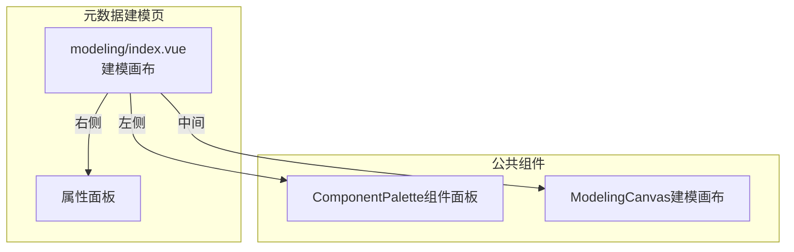
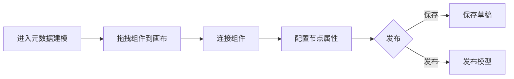

---
neo4j:
  feature: "FEAT-DMT-META-MODELING"
feishu:
  wiki: "V8KEfpg1vlkCZld"
doc:
  title: "FEAT-DMT-META-MODELING元数据建模-Feature说明文档"
  version: "v1.0"
  type: "Feature说明文档"
  productDomain: "PD-DMT"
  epicKey: "Epic:EPIC-DMT-ASSET"
  featureKey: "FEAT-DMT-META-MODELING"
  author: "Tony Stark"
  createdAt: "2026-04-30"
  updatedAt: "2026-04-30"
---

# FEAT-DMT-META-MODELING - 元数据建模

> **版本**: v1.0
> **日期**: 2026-04-30
> **作者**: Tony Stark
> **状态**: 已完成

---

## 1. Feature 基本信息

| 字段 | 内容 |
|:---|:---|
| Feature ID | FEAT-DMT-META-MODELING |
| Feature 名称 | 元数据建模 |
| 所属 EPIC | EPIC-DMT-ASSET 数据资产管理 |
| 所属产品域 | PD-DMT 数据管理 |
| 负责人 | Tony Stark |

---

## 2. Feature 概述

### 2.1 是什么
元数据建模工具，支持对采集的元数据进行业务语义标注和模型设计。

### 2.2 解决什么问题
- 元数据缺乏业务语义
- 数据表之间的关系不清晰
- 难以进行业务层面的数据探索

### 2.3 用户场景

| 场景 | 用户 | 描述 |
|:---|:---|:---|
| 模型设计 | 数据架构师 | 设计数据模型 |
| 关系建模 | 数据开发者 | 建立表间关系 |
| 模型发布 | 数据管理员 | 发布建模成果 |

---

## 3. 系统模块图

### 3.1 页面说明

| 页面 | 路由 | 组件 | 说明 |
|:---|:---|:---|:---|
| 元数据建模 | /management/metadata/modeling | modeling/index.vue | 元数据建模画布页 |

### 3.2 组件说明

| 组件 | 类型 | 说明 |
|:---|:---|:---|
| ComponentPalette | 业务 | 建模组件面板 |
| ModelingCanvas | 业务 | 建模画布组件 |

---

## 4. 功能说明

### 4.1 功能清单

| 功能点 | 类型 | 描述 |
|:---|:---|:---|
| FP-001 | 页面 | 拖拽添加，添加建模组件。**交互**：从左侧面板拖拽组件到画布，**组件类型**：数据表、字段、业务实体、关系线 |
| FP-002 | 页面 | 连接组件，创建组件间关系。**交互**：拖拽连接线连接两个节点 |
| FP-003 | 页面 | 配置属性，配置节点属性。**交互**：点击节点 → 右侧属性面板，**可配属性**：节点名称、描述、标签 |
| FP-004 | 页面 | 保存/发布模型，保存或发布建模成果。**交互**：点击"保存"按钮保存草稿，点击"发布"按钮发布模型 |

### 4.2 用户流程

---

## 5. 验收标准

| 验收项 | 标准 |
|:---|:---|
| 功能验收 | 支持拖拽添加数据表、字段、业务实体、关系线组件 |
| 功能验收 | 支持拖拽连接线创建组件间关系 |
| 功能验收 | 点击节点弹出属性面板，支持配置名称、描述、标签 |
| 功能验收 | 保存按钮保存草稿，发布按钮发布模型 |
| 功能验收 | 发布后模型状态变为已发布 |
| 交互验收 | 画布支持缩放和拖拽 |
| 性能验收 | 画布加载时间≤3s |

---

## 6. 依赖关系

| 依赖项 | 类型 | 说明 |
|:---|:---|:---|
| FEAT-DMT-META-COLLECT | 上游 | 元数据建模依赖采集的元数据 |

---

## 7. 变更记录

| 日期 | 版本 | 变更内容 | 作者 |
|:---|:---:|:---|:---|
| 2026-04-30 | v1.0 | 初始版本，按功能清单模块重新梳理，符合模板v1.2 | Tony Stark |

---

🦾 *Feature说明文档 v1.0 - 元数据建模*