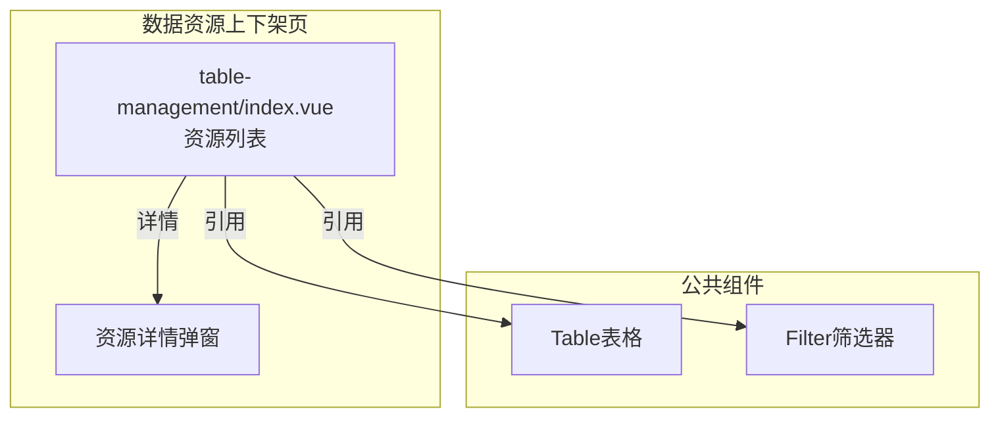
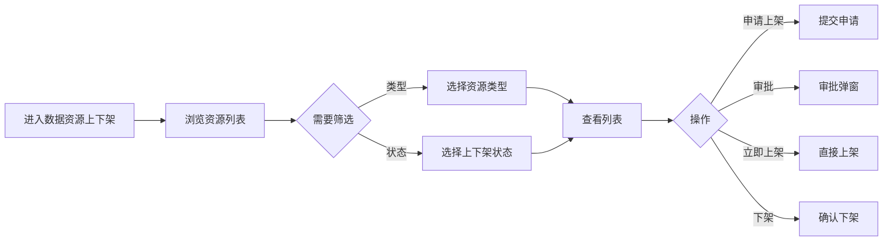

---
neo4j:
  feature: "FEAT-DMT-RESOURCE-LISTING"
feishu:
  wiki: "V8KEfpg1vlkCZld"
doc:
  title: "FEAT-DMT-RESOURCE-LISTING数据资源上下架-Feature说明文档"
  version: "v1.0"
  type: "Feature说明文档"
  productDomain: "PD-DMT"
  epicKey: "Epic:EPIC-DMT-ASSET"
  featureKey: "FEAT-DMT-RESOURCE-LISTING"
  author: "Tony Stark"
  createdAt: "2026-04-30"
  updatedAt: "2026-04-30"
---

# FEAT-DMT-RESOURCE-LISTING - 数据资源上下架

> **版本**: v1.0
> **日期**: 2026-04-30
> **作者**: Tony Stark
> **状态**: 已完成

---

## 1. Feature 基本信息

| 字段 | 内容 |
|:---|:---|
| Feature ID | FEAT-DMT-RESOURCE-LISTING |
| Feature 名称 | 数据资源上下架 |
| 所属 EPIC | EPIC-DMT-ASSET 数据资产管理 |
| 所属产品域 | PD-DMT 数据管理 |
| 负责人 | Tony Stark |

---

## 2. Feature 概述

### 2.1 是什么
数据资源的发布和下架管理，控制数据资产的可用性。

### 2.2 解决什么问题
- 数据资源缺乏统一的上架流程
- 资源可用性难以控制
- 上下架状态不透明

### 2.3 用户场景

| 场景 | 用户 | 描述 |
|:---|:---|:---|
| 资源检索 | 数据分析师 | 搜索和浏览数据资源 |
| 上架申请 | 数据开发者 | 申请发布数据资源 |
| 审批上架 | 数据管理员 | 审批上架申请 |

---

## 3. 系统模块图

### 3.1 页面说明

| 页面 | 路由 | 组件 | 说明 |
|:---|:---|:---|:---|
| 数据资源上下架 | /management/asset-management/data-resources | table-management/index.vue | 数据资源上下架管理页 |

### 3.2 组件说明

| 组件 | 类型 | 说明 |
|:---|:---|:---|
| Table | 公共 | 列表展示组件 |
| Filter | 业务 | 筛选器组件 |

---

## 4. 功能说明

### 4.1 功能清单

| 功能点 | 类型 | 描述 |
|:---|:---|:---|
| FP-001 | 页面 | 资源检索，按名称模糊匹配。**筛选器**：资源名称文本(模糊匹配)、资源类型下拉(表/视图/API)、上下架状态下拉(已上架/待上架/已下架)、业务域下拉 |
| FP-002 | 页面 | 申请上架，申请发布数据资源。**交互**：点击"申请上架"按钮，**流程**：申请→审批→开通 |
| FP-003 | 页面 | 审批上架，审批上架申请。**交互**：点击"审批"按钮，**结果**：通过/驳回 |
| FP-004 | 页面 | 立即上架，直接上架资源。**交互**：点击"立即上架"按钮，**权限**：管理员可直接上架 |
| FP-005 | 页面 | 下架资源，下架数据资源。**交互**：点击"下架"按钮，**确认**：需二次确认 |

### 4.2 用户流程

---

## 5. 验收标准

| 验收项 | 标准 |
|:---|:---|
| 功能验收 | 资源检索支持名称模糊匹配 |
| 功能验收 | 类型筛选支持表/视图/API |
| 功能验收 | 状态筛选正确区分已上架/待上架/已下架 |
| 功能验收 | 申请上架提交后状态变为待上架 |
| 功能验收 | 审批通过后资源变为已上架 |
| 功能验收 | 立即上架仅管理员可用 |
| 功能验收 | 下架需要二次确认 |
| 功能验收 | 列表支持分页 |
| 性能验收 | 页面加载时间≤2s |

---

## 6. 依赖关系

| 依赖项 | 类型 | 说明 |
|:---|:---|:---|
| FEAT-DMT-META-COLLECT | 上游 | 资源来源于元数据采集 |
| PD-DFD | 下游 | 上架后的资源供 PD-DFD 展示 |

---

## 7. 变更记录

| 日期 | 版本 | 变更内容 | 作者 |
|:---|:---:|:---|:---|
| 2026-04-30 | v1.0 | 初始版本，按功能清单模块重新梳理，符合模板v1.2 | Tony Stark |

---

🦾 *Feature说明文档 v1.0 - 数据资源上下架*