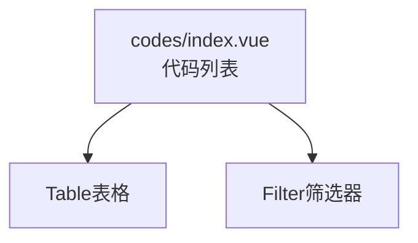

---
neo4j:
  feature: "FEAT-DMT-STD-CODE"
feishu:
  wiki: "V8KEfpg1vlkCZld"
doc:
  title: "FEAT-DMT-STD-CODE标准代码管理-Feature说明文档"
  version: "v1.0"
  type: "Feature说明文档"
  productDomain: "PD-DMT"
  epicKey: "Epic:EPIC-DMT-STD"
  featureKey: "FEAT-DMT-STD-CODE"
  author: "Tony Stark"
  createdAt: "2026-04-30"
  updatedAt: "2026-04-30"
---

# FEAT-DMT-STD-CODE - 标准代码管理

## 1. 基本信息

| 字段 | 内容 |
|:---|:---|
| Feature ID | FEAT-DMT-STD-CODE |
| Feature 名称 | 标准代码管理 |
| 所属 EPIC | EPIC-DMT-STD 数据标准治理 |
| 所属产品域 | PD-DMT 数据管理 |

## 2. 概述

### 2.1 是什么
标准代码值定义，如性别代码、状态代码等。

### 2.2 解决什么问题
- 代码值不统一
- 缺乏标准化代码值定义

### 2.3 用户场景
| 场景 | 用户 | 描述 |
|:---|:---|:---|
| 代码检索 | 数据分析师 | 搜索代码 |
| 类型筛选 | 数据开发者 | 按类型筛选 |

## 3. 系统模块图

## 4. 功能说明

### 4.1 功能清单

| 功能点 | 类型 | 描述 |
|:---|:---|:---|
| FP-001 | 页面 | 代码检索，按名称模糊匹配。**筛选器**：代码名称文本(模糊匹配)、代码类型下拉(枚举代码/区间代码)、状态下拉(启用/停用) |
| FP-002 | 页面 | 新建代码，创建新的代码。**交互**：点击"新建"按钮弹出表单 |
| FP-003 | 页面 | 编辑代码，修改代码内容。**交互**：点击"编辑"按钮弹出表单 |

## 5. 验收标准

| 验收项 | 标准 |
|:---|:---|
| 功能验收 | 代码检索支持名称模糊匹配 |
| 功能验收 | 类型筛选正确区分枚举/区间代码 |
| 功能验收 | 新建/编辑代码表单完整 |
| 功能验收 | 列表支持分页 |

## 6. 依赖关系

| 依赖项 | 类型 | 说明 |
|:---|:---|:---|
| 无 | - | 标准代码是独立结构 |

## 7. 变更记录

| 日期 | 版本 | 变更内容 | 作者 |
|:---|:---:|:---|:---|
| 2026-04-30 | v1.0 | 初始版本 | Tony Stark |

---

🦾 *v1.0 - 标准代码管理*