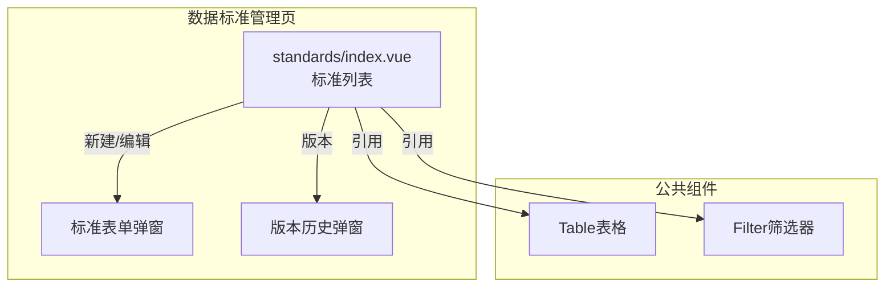
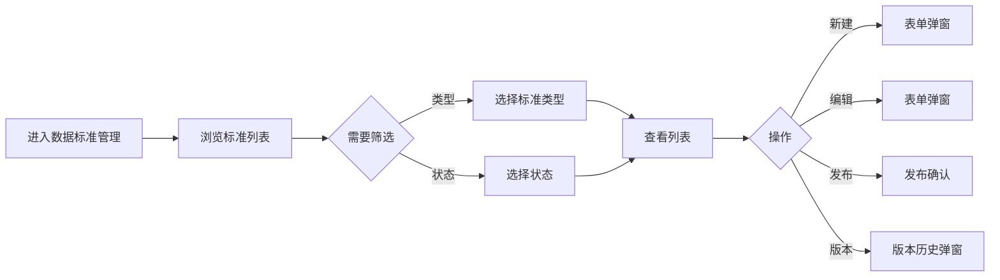

---
neo4j:
  feature: "FEAT-DMT-STD-DEF"
feishu:
  wiki: "V8KEfpg1vlkCZld"
doc:
  title: "FEAT-DMT-STD-DEF数据标准管理-Feature说明文档"
  version: "v1.0"
  type: "Feature说明文档"
  productDomain: "PD-DMT"
  epicKey: "Epic:EPIC-DMT-STD"
  featureKey: "FEAT-DMT-STD-DEF"
  author: "Tony Stark"
  createdAt: "2026-04-30"
  updatedAt: "2026-04-30"
---

# FEAT-DMT-STD-DEF - 数据标准管理

> **版本**: v1.0
> **日期**: 2026-04-30
> **作者**: Tony Stark
> **状态**: 已完成

---

## 1. Feature 基本信息

| 字段 | 内容 |
|:---|:---|
| Feature ID | FEAT-DMT-STD-DEF |
| Feature 名称 | 数据标准管理 |
| 所属 EPIC | EPIC-DMT-STD 数据标准治理 |
| 所属产品域 | PD-DMT 数据管理 |
| 负责人 | Tony Stark |

---

## 2. Feature 概述

### 2.1 是什么
数据标准定义和管理，建立统一的数据定义规范。

### 2.2 解决什么问题
- 数据定义不统一，不同系统口径不一致
- 缺乏标准化的数据命名规范
- 标准版本管理混乱

### 2.3 用户场景

| 场景 | 用户 | 描述 |
|:---|:---|:---|
| 标准检索 | 数据分析师 | 搜索和浏览数据标准 |
| 类型筛选 | 数据开发者 | 按标准类型筛选 |
| 版本管理 | 数据管理员 | 管理标准版本 |

---

## 3. 系统模块图

### 3.1 页面说明

| 页面 | 路由 | 组件 | 说明 |
|:---|:---|:---|:---|
| 数据标准管理 | /management/data-standard/standards | standards/index.vue | 数据标准管理页 |

### 3.2 组件说明

| 组件 | 类型 | 说明 |
|:---|:---|:---|
| Table | 公共 | 标准列表组件 |
| Filter | 业务 | 筛选器组件 |

---

## 4. 功能说明

### 4.1 功能清单

| 功能点 | 类型 | 描述 |
|:---|:---|:---|
| FP-001 | 页面 | 标准检索，按名称模糊匹配。**筛选器**：标准名称文本(模糊匹配)、标准类型下拉(字段标准/指标标准/代码标准)、状态下拉(草稿/已发布/已废弃) |
| FP-002 | 页面 | 新建标准，创建新的数据标准。**交互**：点击"新建"按钮弹出表单，**必填**：标准编码、标准名称、标准类型 |
| FP-003 | 页面 | 编辑标准，修改标准内容。**交互**：点击"编辑"按钮弹出表单，预填充现有数据 |
| FP-004 | 页面 | 发布标准，发布数据标准。**交互**：点击"发布"按钮，**前置条件**：草稿状态才能发布 |
| FP-005 | 页面 | 版本管理，查看标准版本历史。**交互**：点击"版本"按钮弹出版本历史弹窗，**记录**：版本号、发布时间、发布人 |

### 4.2 用户流程

---

## 5. 验收标准

| 验收项 | 标准 |
|:---|:---|
| 功能验收 | 标准检索支持名称模糊匹配 |
| 功能验收 | 类型筛选正确区分字段标准/指标标准/代码标准 |
| 功能验收 | 状态筛选正确区分草稿/已发布/已废弃 |
| 功能验收 | 新建标准必填：标准编码、标准名称、标准类型 |
| 功能验收 | 编辑标准预填充现有数据 |
| 功能验收 | 发布标准前置条件：草稿状态 |
| 功能验收 | 版本历史正确展示版本号、发布时间、发布人 |
| 功能验收 | 列表支持分页 |
| 性能验收 | 页面加载时间≤2s |

---

## 6. 依赖关系

| 依赖项 | 类型 | 说明 |
|:---|:---|:---|
| FEAT-DMT-STD-CHECK | 下游 | 标准稽核依赖标准定义 |

---

## 7. 变更记录

| 日期 | 版本 | 变更内容 | 作者 |
|:---|:---:|:---|:---|
| 2026-04-30 | v1.0 | 初始版本，按功能清单模块重新梳理，符合模板v1.2 | Tony Stark |

---

🦾 *Feature说明文档 v1.0 - 数据标准管理*