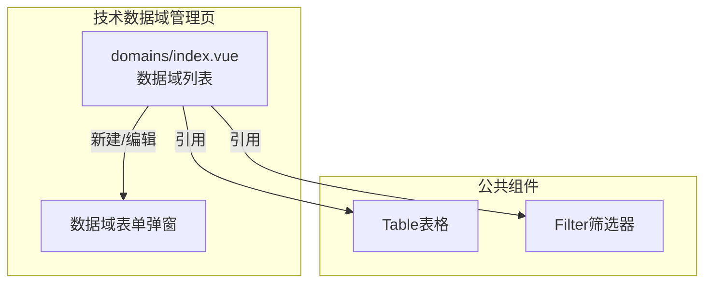
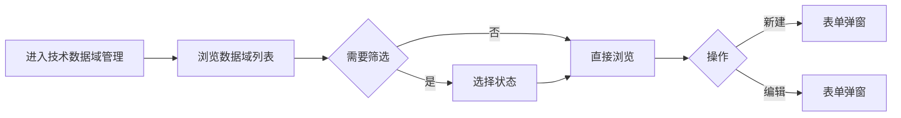

---
neo4j:
  feature: "FEAT-DMT-STD-DOMAIN"
feishu:
  wiki: "V8KEfpg1vlkCZld"
doc:
  title: "FEAT-DMT-STD-DOMAIN技术数据域管理-Feature说明文档"
  version: "v1.0"
  type: "Feature说明文档"
  productDomain: "PD-DMT"
  epicKey: "Epic:EPIC-DMT-STD"
  featureKey: "FEAT-DMT-STD-DOMAIN"
  author: "Tony Stark"
  createdAt: "2026-04-30"
  updatedAt: "2026-04-30"
---

# FEAT-DMT-STD-DOMAIN - 技术数据域管理

> **版本**: v1.0
> **日期**: 2026-04-30
> **作者**: Tony Stark
> **状态**: 已完成

---

## 1. Feature 基本信息

| 字段 | 内容 |
|:---|:---|
| Feature ID | FEAT-DMT-STD-DOMAIN |
| Feature 名称 | 技术数据域管理 |
| 所属 EPIC | EPIC-DMT-STD 数据标准治理 |
| 所属产品域 | PD-DMT 数据管理 |
| 负责人 | Tony Stark |

---

## 2. Feature 概述

### 2.1 是什么
技术数据域划分和管理，建立技术层面的数据分类体系。

### 2.2 解决什么问题
- 缺乏技术层面的数据分类
- 数据表难以按技术维度组织
- 技术域与表的归属关系不清晰

### 2.3 用户场景

| 场景 | 用户 | 描述 |
|:---|:---|:---|
| 数据域检索 | 数据工程师 | 搜索和浏览技术数据域 |
| 状态筛选 | 数据开发者 | 按状态筛选 |
| 包含表查看 | 数据管理员 | 查看域下的数据表 |

---

## 3. 系统模块图

### 3.1 页面说明

| 页面 | 路由 | 组件 | 说明 |
|:---|:---|:---|:---|
| 技术数据域管理 | /management/data-standard/domains | domains/index.vue | 技术数据域管理页 |

### 3.2 组件说明

| 组件 | 类型 | 说明 |
|:---|:---|:---|
| Table | 公共 | 列表展示组件 |
| Filter | 业务 | 筛选器组件 |

---

## 4. 功能说明

### 4.1 功能清单

| 功能点 | 类型 | 描述 |
|:---|:---|:---|
| FP-001 | 页面 | 数据域检索，按名称模糊匹配。**筛选器**：数据域名称文本(模糊匹配)、状态下拉(启用/停用) |
| FP-002 | 页面 | 新建数据域，创建新的数据域。**交互**：点击"新建"按钮弹出表单，**必填**：数据域编码、数据域名称 |
| FP-003 | 页面 | 编辑数据域，修改数据域信息。**交互**：点击"编辑"按钮弹出表单，预填充现有数据 |

### 4.2 用户流程

---

## 5. 验收标准

| 验收项 | 标准 |
|:---|:---|
| 功能验收 | 数据域检索支持名称模糊匹配 |
| 功能验收 | 状态筛选正确区分启用/停用 |
| 功能验收 | 新建数据域必填：数据域编码、数据域名称 |
| 功能验收 | 编辑数据域预填充现有数据 |
| 功能验收 | 列表支持分页 |
| 性能验收 | 页面加载时间≤2s |

---

## 6. 依赖关系

| 依赖项 | 类型 | 说明 |
|:---|:---|:---|
| 无 | - | 技术数据域是独立结构 |

---

## 7. 变更记录

| 日期 | 版本 | 变更内容 | 作者 |
|:---|:---:|:---|:---|
| 2026-04-30 | v1.0 | 初始版本，按功能清单模块重新梳理，符合模板v1.2 | Tony Stark |

---

🦾 *Feature说明文档 v1.0 - 技术数据域管理*